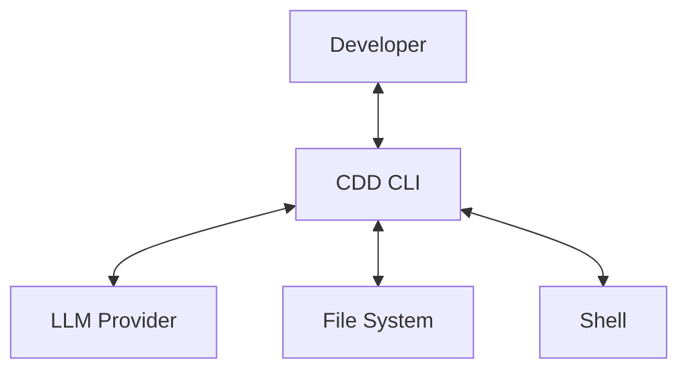
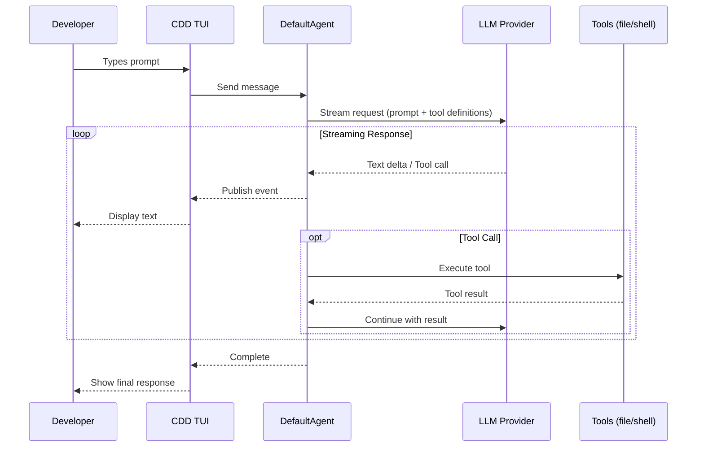

# CDD - System Context (C1)

## Overview

CDD (Context-Driven Development) is an AI-powered coding assistant CLI written in Go. It connects developers to large language models with direct access to file system and shell tools, enabling AI-assisted coding workflows in the terminal. The current implementation provides a single general-purpose coding agent that streams responses and executes tools on behalf of the developer.

The developer interacts with CDD through a terminal-based TUI (Text User Interface), sending natural language prompts and reviewing AI responses and tool actions. CDD sends prompts with tool definitions to the LLM via HTTPS and receives streamed responses containing text and tool calls. The agent reads, searches, and modifies project files on behalf of the developer, and executes shell commands to run tests, install packages, perform git operations, and other command-line tasks. Currently, all tools execute without permission prompts. The tool registry classifies tools as safe/unsafe (metadata exists), but no approval flow is implemented yet.

## LLM Providers

CDD supports multiple LLM providers through a unified interface. Anthropic provides Claude models (Opus, Sonnet, Haiku) with API Key or OAuth authentication. OpenAI provides GPT-4 and GPT-3.5 models with API Key authentication. Custom providers can use any OpenAI-compatible API endpoint with API Key authentication. Only the "large" model tier is currently used in the codebase. The "small" model tier is configured but not yet wired into the execution flow.

| Provider | Models | Auth Method |
|----------|--------|-------------|
| Anthropic | Claude (Opus, Sonnet, Haiku) | API Key or OAuth |
| OpenAI | GPT-4, GPT-3.5 | API Key |
| Custom | Any OpenAI-compatible API | API Key |

## Data Flow

When a developer sends a message, the TUI captures the input and sends it to the Agent. The Agent streams the request to the LLM Provider with the full prompt and tool definitions. The LLM responds with text deltas and tool calls. For each tool call, the Agent executes the requested operation through the Tools registry (file operations or shell commands), sends the result back to the LLM, and continues streaming. The Agent publishes events throughout this process, which the TUI subscribes to for real-time display updates.

## Key Files

The main entry points and core files in the CDD codebase are organized as follows. The CLI entry point is at `cmd/root.go`. The agent implementation lives in `internal/agent/loop.go`. The tool registry is at `internal/tools/registry.go`. The provider abstraction layer is in `internal/provider/provider.go`. The TUI chat page is implemented in `internal/tui/page/chat/chat.go`.

| Component | Path |
|-----------|------|
| CLI entry point | `cmd/root.go` |
| Agent implementation | `internal/agent/loop.go` |
| Tool registry | `internal/tools/registry.go` |
| Provider abstraction | `internal/provider/provider.go` |
| TUI chat page | `internal/tui/page/chat/chat.go` |

## What's Not Yet Implemented

The following features are planned but not yet implemented in the codebase. The Socrates phase (for requirement clarification) is planned but not implemented. The same applies to the other phases: Planner for design, Executor for coding, and Debate for exploration - all are planned but not yet implemented. The small model tier is configured but the code discards it, reserved for future use. Multi-agent orchestration is not available, only a single agent exists currently. The permission system has safe/unsafe metadata on tools, but no approval flow exists yet. Planned permission modes include paranoid, balanced, and yolo. These features will be documented in future C4 diagrams as they're implemented.
