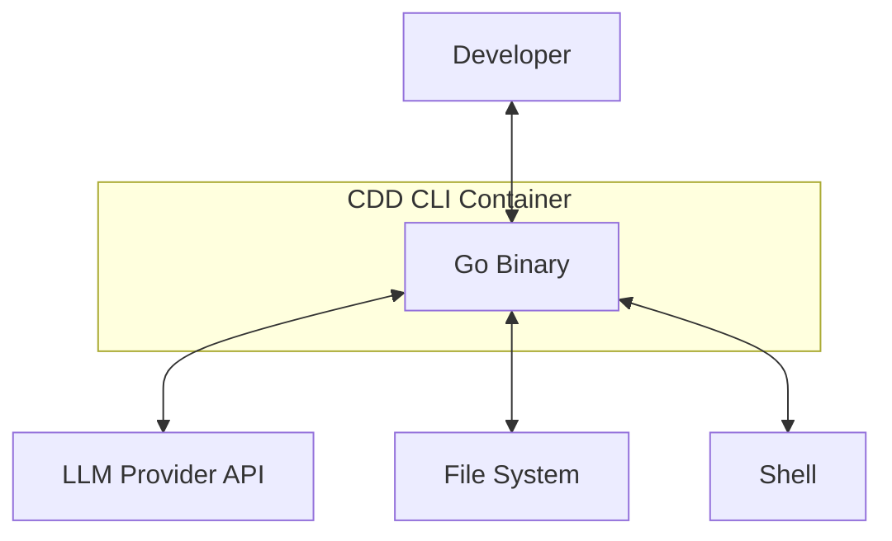
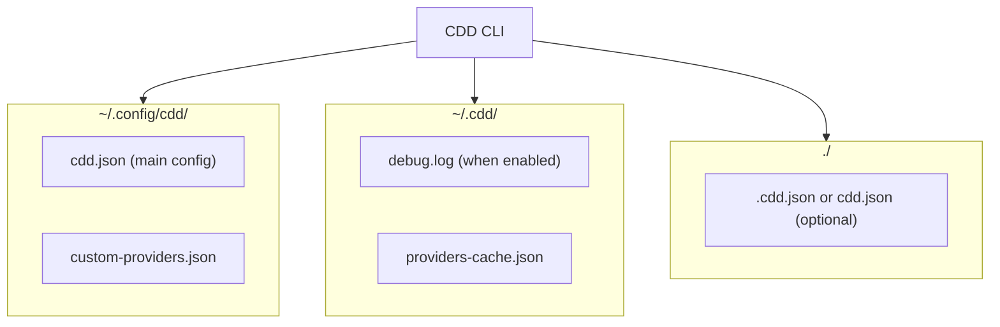
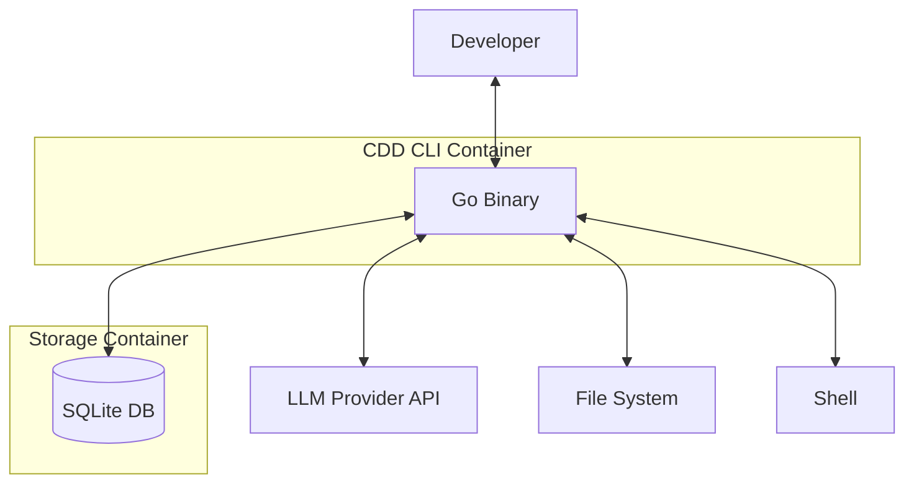

# CDD - Container View (C2)

## Architecture

CDD is currently a single-container system - one Go binary that runs entirely in-memory. All components (TUI, Agent, Tools, Provider, PubSub, Config) execute within the same process. The CDD CLI is a single executable written in Go. It runs as a single process where all components share the same memory space. Session history, messages, and todos are stored in memory and lost on exit. Configuration and OAuth tokens persist to disk, but session history does not. CDD doesn't expose any network ports; it only makes outbound HTTPS calls to LLM provider APIs.



For a CLI tool, a single binary is the simplest deployment model. It's easy to install via `go install` or by downloading the binary directly. There are no external dependencies to manage like databases or caches. Startup is fast since there are no connections to establish. The binary is portable and runs anywhere Go runs.

## File Storage

CDD persists configuration and authentication data to the file system. The main configuration file `cdd.json` lives in `~/.config/cdd/` and contains models, connections, OAuth tokens, and options. Custom provider definitions are stored in `custom-providers.json` in the same directory. The `~/.cdd/` directory holds runtime data like `debug.log` (when debug mode is enabled) and `providers-cache.json` (cached provider metadata with 24-hour TTL). Project-specific configuration can be placed in `.cdd.json` or `cdd.json` in the project directory, which gets merged with the global config.



What is NOT persisted includes session history (conversations), todo lists, file access tracking, and any other runtime state. These are all lost when the CLI exits.

## Internal Components

While there's only one container, CDD has well-defined internal components. The TUI is built with Bubble Tea for the terminal user interface. The Agent handles LLM orchestration and tool execution. Tools provide file and shell operations. The Provider abstracts LLM API communication. PubSub enables event-driven component communication. Config manages loading and saving configuration. These components are detailed in the Component View (C3).

```
CDD CLI Binary
├── TUI (Bubble Tea)      - Terminal user interface
├── Agent                 - LLM orchestration and tool execution
├── Tools                 - File and shell operations
├── Provider              - LLM API abstraction
├── PubSub                - Event system for component communication
└── Config                - Configuration management
```

## Planned: SQLite Storage

A persistent storage layer is planned to enable session persistence (save and resume conversations across CLI restarts), a memory tool (allow the agent to store and recall information long-term), and history search (query past conversations and tool executions). When implemented, this will introduce a second container - the SQLite database file - that the CLI reads from and writes to.



## Key Files

The main entry point for the CLI is `cmd/root.go`. The binary build configuration is in `go.mod` and `Makefile`.
