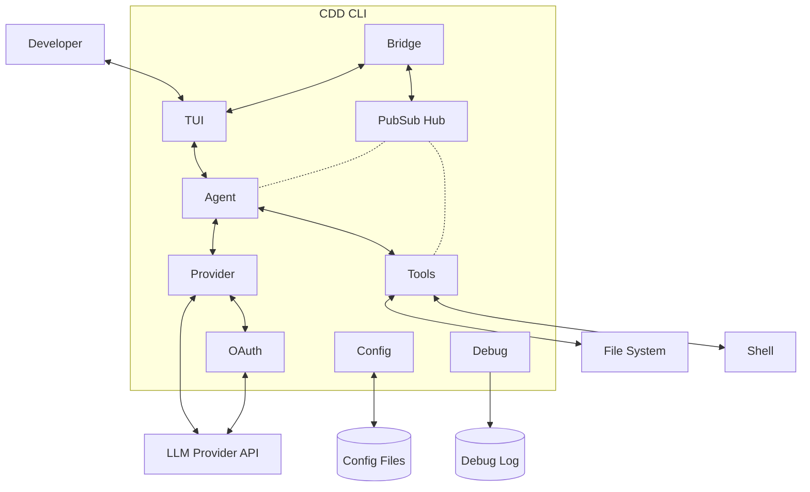

# CDD - Component View (C3)

## Overview

This view zooms into the CDD CLI container to show its internal components and how they communicate.

## Component Diagram

### How the components connect

- **Developer ↔ TUI**: The developer types prompts and sees responses through the Bubble Tea terminal interface.

- **TUI ↔ Agent**: The TUI sends user messages to the agent and receives completion notifications.

- **Bridge ↔ TUI / PubSub**: The Bridge subscribes to PubSub events and forwards them to the TUI as Bubble Tea messages, decoupling the event system from the UI framework.

- **Agent ↔ Provider**: The agent uses the provider to send prompts to the LLM and receive streamed responses.

- **Agent ↔ Tools**: When the LLM requests a tool call, the agent executes it through the tool registry.

- **Provider ↔ OAuth**: For Anthropic, the provider uses OAuth for authentication, including token refresh.

- **Provider ↔ LLM API**: The provider handles HTTP communication with Anthropic/OpenAI APIs.

- **Tools ↔ File System / Shell**: Tools execute file operations and shell commands on the local system.

- **PubSub Hub**: Components publish events (agent progress, tool execution, auth changes). The Bridge subscribes and forwards to TUI.

- **Config ↔ Config Files**: Loads configuration from disk on startup, persists changes (OAuth tokens, model selections).

- **Debug → Log File**: When enabled, writes contextual debug logs to file for troubleshooting.

## Components

### TUI

The terminal user interface (UI framework) is built with Bubble Tea from charmbracelet. Bubble Tea is a Go framework from charmbracelet for building terminal user interfaces using the Elm architecture.

| Aspect | Details |
|--------|---------|
| Technology | Bubble Tea (charmbracelet/bubbletea) |
| Responsibility | Render chat interface, capture input, display streaming responses |
| Key files | `internal/tui/page/chat/chat.go` |

**What it does:**
- Renders the chat conversation with markdown formatting (Glamour, also from charmbracelet)
- Captures user input and sends to agent
- Subscribes to PubSub events to display streaming text and tool activity
- Handles UI state (loading spinners, error messages)

### Agent

The core orchestrator that manages LLM interactions and tool execution.

| Aspect | Details |
|--------|---------|
| Technology | Go, Fantasy SDK (charmbracelet) |
| Responsibility | Send prompts, process responses, execute tool calls |
| Key files | `internal/agent/loop.go` |

**What it does:**
- Maintains conversation history (in-memory)
- Sends messages to LLM via Provider
- Parses streamed responses for text and tool calls
- Executes tools when requested by LLM
- Publishes events (text deltas, tool calls, completions) to PubSub

**Current implementation:** Single `DefaultAgent` - no phase system or agent switching.

### Tools

The registry of tools available to the agent.

| Aspect | Details |
|--------|---------|
| Technology | Go |
| Responsibility | Provide file and shell operations to the agent |
| Key files | `internal/tools/registry.go`, `internal/tools/*.go` |

**Available tools:**

| Tool | Category | Safe | Description |
|------|----------|------|-------------|
| `read` | file | Yes | Read file contents with line numbers |
| `write` | file | No | Create or overwrite files |
| `edit` | file | No | Replace text in existing files |
| `glob` | file | Yes | Find files by pattern |
| `grep` | file | Yes | Search file contents |
| `bash` | shell | No | Execute shell commands |
| `todo_write` | task | Yes | Manage task list for tracking progress |

**Note:** The `Safe` field exists in metadata but no permission system uses it yet.

### Provider

Abstraction layer for LLM API communication.

| Aspect | Details |
|--------|---------|
| Technology | Go, HTTP client |
| Responsibility | Handle authentication, send requests, stream responses |
| Key files | `internal/provider/provider.go` |

**What it does:**
- Abstracts Anthropic and OpenAI APIs behind a common interface
- Manages authentication (API keys, OAuth tokens)
- Handles request/response formatting for each provider
- Streams responses back to the agent

**Supported providers:**

| Provider | Auth Methods |
|----------|--------------|
| Anthropic | API Key, OAuth |
| OpenAI | API Key |
| Custom | API Key (OpenAI-compatible endpoints) |

**Current implementation:** Only "large" model tier is used. "Small" tier is configured but discarded in code.

### PubSub Hub

Event system for component communication.

| Aspect | Details |
|--------|---------|
| Technology | Go generics |
| Responsibility | Decouple components via publish/subscribe |
| Key files | `internal/pubsub/hub.go`, `internal/pubsub/broker.go` |

**What it does:**
- Provides type-safe event brokers using Go generics
- Components publish events without knowing subscribers
- TUI subscribes to agent/tool events to update display
- Enables loose coupling between components

**Event brokers:**

| Broker | Purpose | Example Events |
|--------|---------|----------------|
| Agent | LLM interaction events | Text deltas, progress, complete, failed |
| Tool | Tool execution events | Started, completed, failed |
| Session | Session lifecycle | Session created, switched, cleared |
| Auth | Authentication events | Token refreshed |
| Todo | Task management | Task added, updated, completed |

### Config

Configuration management for the application.

| Aspect | Details |
|--------|---------|
| Technology | Go, JSON files |
| Responsibility | Load, merge, and persist configuration |
| Key files | `internal/config/config.go`, `internal/config/load.go`, `internal/config/save.go` |

**What it does:**
- Loads and merges global (`~/.config/cdd/`) + project (`./.cdd.json`) configs
- Manages connections (named API credentials) and model selections
- Handles OAuth token storage and refresh with immediate persistence
- Resolves environment variables in config values (e.g., `$OPENAI_API_KEY`)
- Supports custom provider definitions
- Detects first-run and needs-setup states

**Key subsystems:**

| Subsystem | Purpose |
|-----------|---------|
| ConnectionManager | CRUD operations for named API connections |
| CustomProviderManager | User-defined LLM provider management |
| ProviderLoader | Merge built-in + custom providers with caching |
| Resolver | Environment variable expansion in config values |

### Bridge

Connects the PubSub event system to the Bubble Tea TUI.

| Aspect | Details |
|--------|---------|
| Technology | Go, goroutines |
| Responsibility | Forward domain events to UI as Bubble Tea messages |
| Key files | `internal/bridge/tui.go`, `internal/bridge/messages.go` |

**What it does:**
- Subscribes to all 5 event brokers (Agent, Tool, Session, Auth, Todo)
- Converts domain events to Bubble Tea `tea.Msg` types
- Runs 5 concurrent goroutines for non-blocking event handling
- Supports session filtering to focus on current conversation
- Graceful shutdown with context cancellation

**Why it exists:** Bubble Tea uses a message-passing model. The Bridge translates PubSub events into that model, keeping the domain layer unaware of the UI framework.

### OAuth

OAuth2 authentication for Claude/Anthropic.

| Aspect | Details |
|--------|---------|
| Technology | Go, HTTP, PKCE |
| Responsibility | Handle OAuth authorization flow and token lifecycle |
| Key files | `internal/oauth/token.go`, `internal/oauth/claude/oauth.go` |

**What it does:**
- Generates PKCE challenges for secure authorization
- Creates authorization URLs for browser-based login
- Exchanges authorization codes for access/refresh tokens
- Refreshes expired tokens (with rotation - old tokens invalidated)
- Tracks token expiry with 10% buffer for proactive refresh

**OAuth flow:**
1. Generate PKCE verifier + challenge
2. Open browser to Claude authorization URL
3. User authorizes, receives code
4. Exchange code for tokens
5. Store tokens in config (persisted immediately)
6. Refresh before expiry (tokens rotate on refresh)

### Debug

Development and troubleshooting logging.

| Aspect | Details |
|--------|---------|
| Technology | Go, file I/O |
| Responsibility | Contextual logging for development |
| Key files | `internal/debug/debug.go` |

**What it does:**
- Writes logs to `~/.cdd/debug.log` when enabled (`--debug` flag)
- Filters noisy events (cursor blinks, spinner ticks, viewport updates)
- Provides specialized loggers for different contexts (API, Auth, Token)
- High-priority logs (API, Auth, Token) bypass noise filtering
- Thread-safe with immediate flush for real-time viewing

**Log types:**

| Function | Purpose | Filtered |
|----------|---------|----------|
| `debug.Log()` | General logging | Yes |
| `debug.Event()` | TUI events | Yes |
| `debug.Error()` | Errors with context | Yes |
| `debug.API()` | API calls | No |
| `debug.Auth()` | Auth events | No |
| `debug.Token()` | Token lifecycle | No |

## Data Flow Example

When the developer sends a message:

1. **TUI** captures input, calls `Agent.Send(message)`
2. **Agent** adds message to history, calls **Provider** with full context
3. **Provider** sends HTTP request to LLM API, streams response
4. **Agent** receives chunks, publishes text delta events to **PubSub**
5. **TUI** (subscribed) receives events, updates display
6. If LLM requests tool call:
   - **Agent** calls **Tools** registry to execute
   - **Tools** performs file/shell operation
   - **Agent** publishes tool result event
   - **Agent** sends result back to LLM, continues streaming
7. **Agent** publishes completion event
8. **TUI** shows final response

## Key Files Summary

| Component | Primary File | Supporting Files |
|-----------|--------------|------------------|
| TUI | `internal/tui/page/chat/chat.go` | `internal/tui/components/`, `internal/tui/page/` |
| Bridge | `internal/bridge/tui.go` | `internal/bridge/messages.go` |
| Agent | `internal/agent/loop.go` | `internal/agent/session.go`, `internal/agent/prompt.go` |
| Tools | `internal/tools/registry.go` | `internal/tools/*.go` (one per tool) |
| Provider | `internal/provider/provider.go` | - |
| OAuth | `internal/oauth/claude/oauth.go` | `internal/oauth/token.go`, `internal/oauth/claude/challenge.go` |
| PubSub | `internal/pubsub/hub.go` | `internal/pubsub/broker.go`, `internal/events/` |
| Config | `internal/config/config.go` | `internal/config/load.go`, `internal/config/connection.go`, `internal/config/custom_provider.go` |
| Debug | `internal/debug/debug.go` | - |

## What's Not Yet Implemented

- **Phase system**: Components for Socrates, Planner, Executor, Debate phases
- **Permission service**: Component to gate tool execution based on safe/unsafe classification
- **Session persistence**: Component to save/load conversation state (requires SQLite container)
- **Memory tool**: Component for long-term agent memory storage
