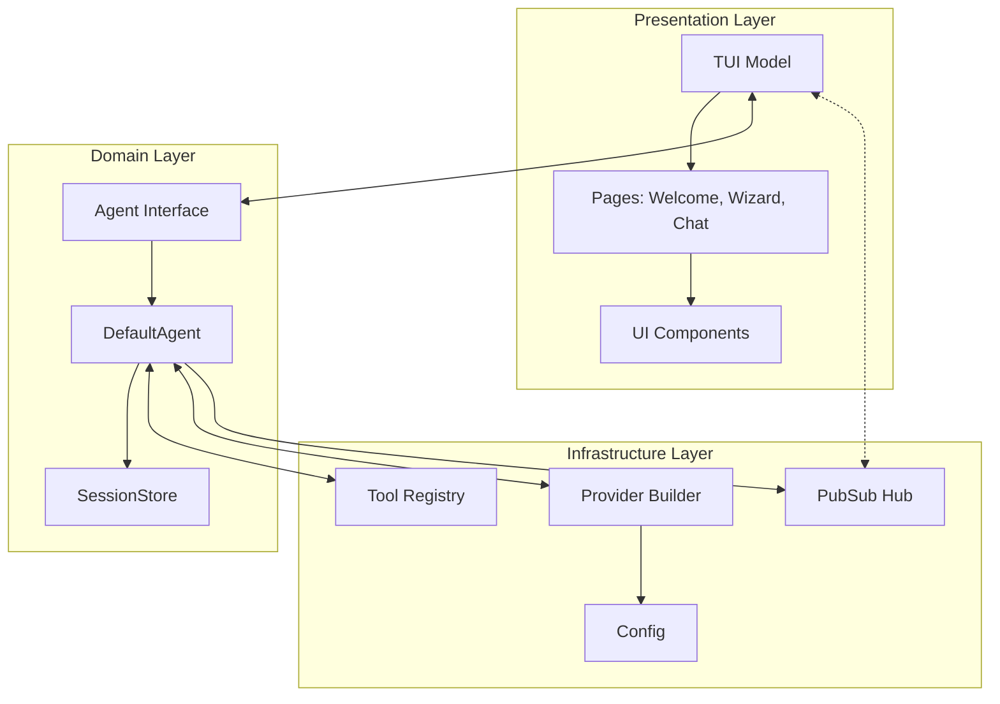
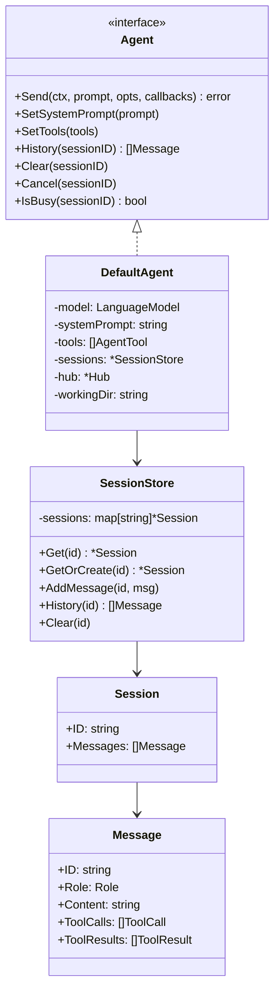
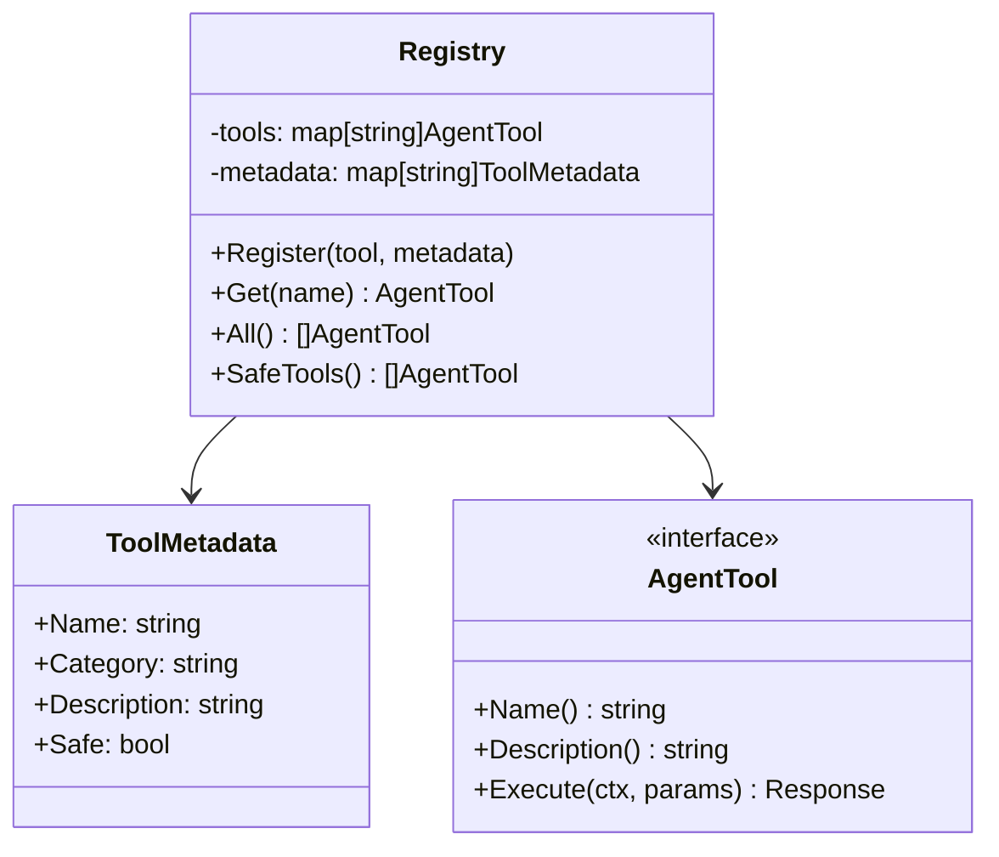
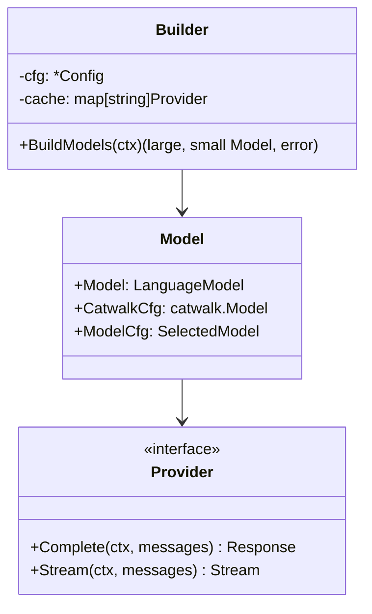
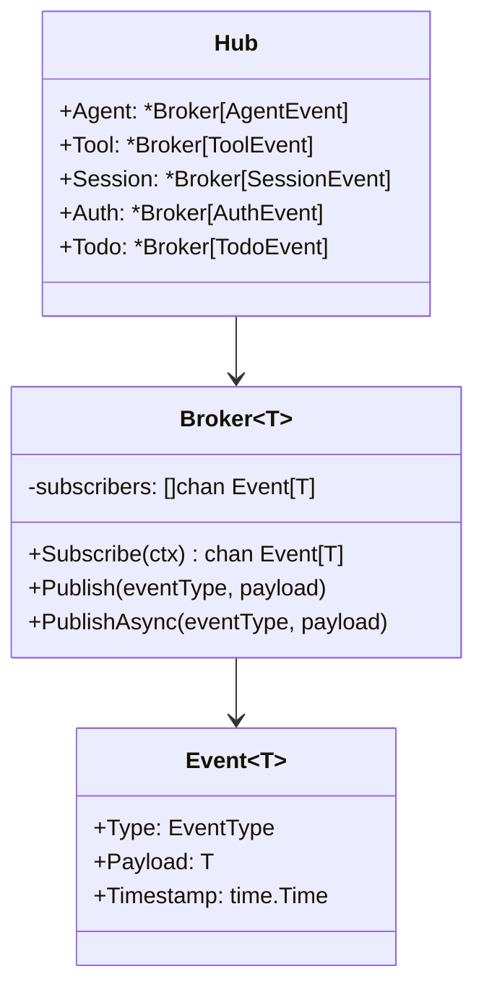
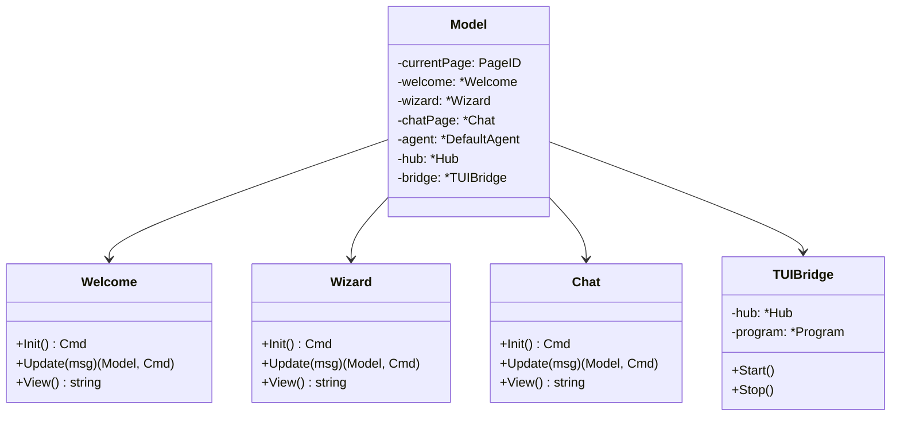
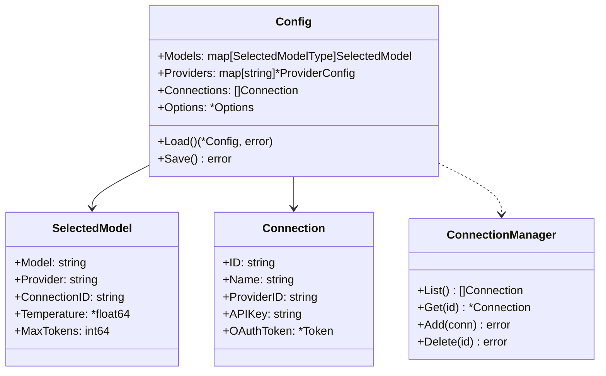
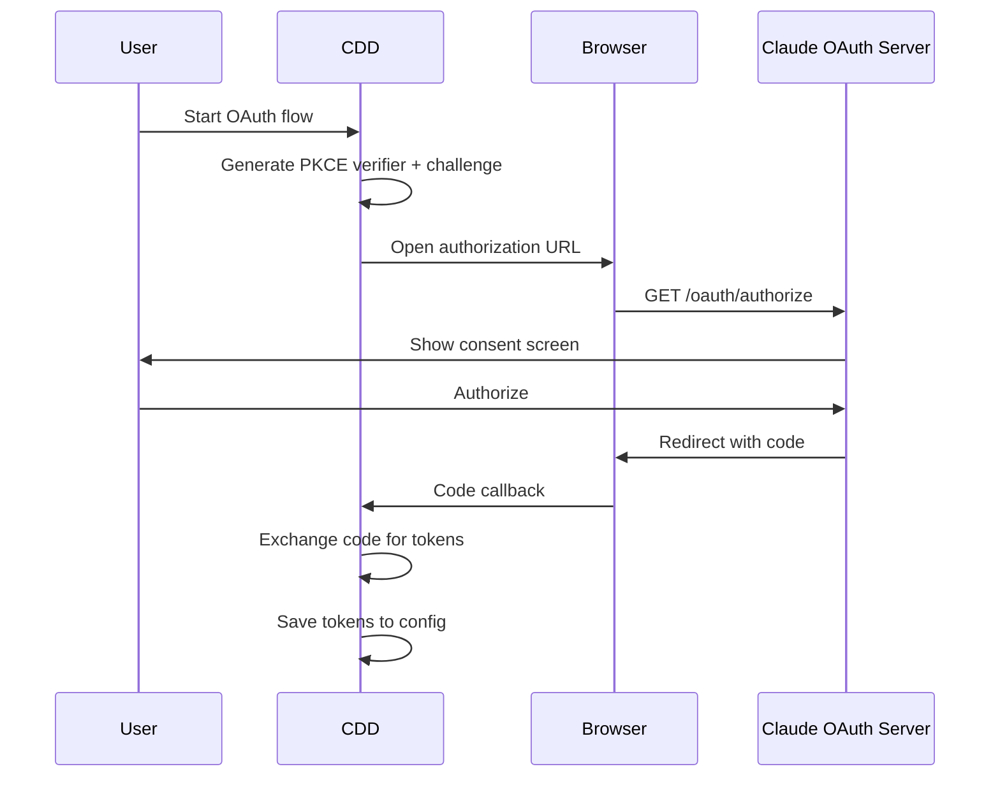

# CDD - Code Level (C4)

## Overview

This document helps contributors understand CDD's code structure and provides guidance for extending the system. CDD is organized into layers: the Presentation Layer (TUI) handles user interaction, the Domain Layer (Agent) manages LLM orchestration, and the Infrastructure Layer provides tools, providers, events, and configuration. The architecture uses interfaces and dependency injection to keep components loosely coupled and testable.



---

## Agent

The Agent is the core orchestrator that manages LLM interactions, executes tools, and maintains conversation history. The Agent interface defines the contract that all agent implementations must follow. It provides methods for sending messages (Send), configuring the system prompt (SetSystemPrompt), setting available tools (SetTools), accessing conversation history (History), clearing sessions (Clear), cancelling requests (Cancel), and checking if a session is busy (IsBusy). The DefaultAgent is the primary implementation that uses the Fantasy SDK to communicate with LLM providers.

```go
// File: internal/agent/agent.go
type Agent interface {
    Send(ctx context.Context, prompt string, opts SendOptions, callbacks StreamCallbacks) error
    SetSystemPrompt(prompt string)
    SetTools(tools []fantasy.AgentTool)
    History(sessionID string) []Message
    Clear(sessionID string)
    Cancel(sessionID string)
    IsBusy(sessionID string) bool
}
```

The DefaultAgent maintains several key fields: a LanguageModel for LLM communication, a system prompt string, a list of AgentTool instances, a SessionStore for conversation history, a Hub for publishing events, and a working directory path. The SessionStore uses an in-memory map protected by a mutex to store Session objects. Each Session contains an ID, a list of Messages, and timestamps. Messages include an ID, Role (user/assistant/system/tool), Content string, and optional ToolCalls and ToolResults.



The agent loop handles the streaming conversation flow. When the TUI calls Send with a prompt, the agent gets or creates a session, adds the user message to history, creates a Fantasy agent with the configured tools, and starts streaming. During streaming, the LLM sends text deltas and tool calls. For text deltas, the agent publishes an AgentEvent and invokes the OnText callback. For tool calls, the agent executes the tool through the registry, publishes a ToolEvent with the result, and continues streaming with the tool result. When streaming completes, the agent saves the assistant message to history.

The key files for the Agent module are: `internal/agent/agent.go` for the Agent interface definition, `internal/agent/loop.go` for the DefaultAgent implementation, `internal/agent/session.go` for the SessionStore managing conversation history, `internal/agent/prompt.go` for the default system prompt, and `internal/agent/message.go` for Message, ToolCall, and ToolResult types. To extend the agent, add methods to the Agent interface in agent.go and implement them in DefaultAgent in loop.go. To modify the system prompt, call agent.SetSystemPrompt("Your custom prompt here").

---

## Tools

Tools give the agent capabilities to interact with the file system, shell, and other resources. The tool system is built around a Registry that holds AgentTool instances along with their ToolMetadata. The Registry provides methods to Register tools, Get a tool by name, list All tools, get only SafeTools, or Filter to a specific set. Each tool has metadata including Name, Category (file, shell, task), Description, and a Safe boolean indicating whether it modifies state.



The built-in tools are: `read` (file, safe) for reading file contents, `write` (file, unsafe) for creating or overwriting files, `edit` (file, unsafe) for replacing text in existing files, `glob` (file, safe) for finding files by pattern, `grep` (file, safe) for searching file contents, `bash` (shell, unsafe) for executing shell commands, and `todo_write` (task, safe) for managing the task list. Each tool is implemented in its own file under `internal/tools/`.

To create a new tool, first define a parameters struct with JSON tags and descriptions for each field. Then create the tool function using fantasy.NewAgentTool, providing the tool name, a description with parameter documentation and examples, and a handler function. The handler receives a context, the parsed parameters, and the tool call info. Use context utilities like SessionIDFromContext and WorkingDirFromContext to access session info. Return responses using fantasy.NewTextResponse for success or fantasy.NewTextErrorResponse for errors. Finally, register the tool in NewDefaultRegistry in registry.go with appropriate ToolMetadata including the Safe flag.

```go
// Example: Creating a new tool
func NewMyTool() fantasy.AgentTool {
    return fantasy.NewAgentTool(
        "my_tool",
        "My tool description with parameters and examples",
        func(ctx context.Context, params MyToolParams, call fantasy.ToolCall) (fantasy.ToolResponse, error) {
            sessionID := SessionIDFromContext(ctx)
            workingDir := WorkingDirFromContext(ctx)
            // Implementation here
            return fantasy.NewTextResponse("result"), nil
        },
    )
}

// Register in registry.go
r.Register(NewMyTool(), ToolMetadata{
    Name:     "my_tool",
    Category: "custom",
    Safe:     true,
})
```

---

## Provider

The Provider module abstracts LLM API communication, supporting multiple backends through a unified interface. The Builder struct takes a Config and maintains a cache of providers. The BuildModels method returns large and small Model instances. Each Model contains a LanguageModel for API calls, CatwalkCfg with model metadata, and ModelCfg with user settings. The Provider interface (from the Fantasy SDK) defines Complete and Stream methods for LLM communication.

CDD supports three provider types: Anthropic (with API Key or OAuth authentication, base URL https://api.anthropic.com), OpenAI (with API Key authentication, base URL https://api.openai.com/v1), and Custom (API Key authentication with user-configured OpenAI-compatible base URLs). The provider selection flow loads provider and model configuration, checks if the provider is already cached, creates a new provider if needed, and builds the LanguageModel.



The key files are `internal/provider/provider.go` for the Builder, Model types, and provider creation logic, `internal/oauth/claude/` for Anthropic OAuth flow, and `internal/config/config.go` for provider configuration. To swap models at runtime, rebuild using builder.BuildModels(ctx) and call agent.SetModel(large.Model).

---

## PubSub

The PubSub event system enables loose coupling between components using a publish-subscribe pattern. The Hub struct contains five typed Broker instances: Agent for LLM interaction events, Tool for tool execution events, Session for session lifecycle events, Auth for authentication events, and Todo for task management events. Each Broker maintains a list of subscriber channels protected by a mutex.



Agent events (defined in `internal/events/agent.go`) include: text_delta when streaming a text chunk, tool_call when the LLM requests a tool, tool_result when tool execution completes, complete when the response finishes, error when an error occurs, and cancelled when a request is cancelled. Tool events (defined in `internal/events/tool.go`) include: started when a tool begins, progress for progress updates, completed when finished, and failed on error.

To publish events, use the appropriate broker: `hub.Agent.Publish(pubsub.EventProgress, events.NewTextDeltaEvent(sessionID, messageID, "text"))` for synchronous publishing or `hub.Tool.PublishAsync(eventType, payload)` for non-blocking publishing. To subscribe to events, call Subscribe with a context to get a channel: `events := hub.Agent.Subscribe(ctx)`. Then range over the channel and switch on event.Type to handle different event types.

---

## TUI

The TUI (Terminal User Interface) is built with the Bubble Tea framework from Charm. The main Model struct maintains the current page ID, page instances (Welcome, Wizard, Chat), the agent, PubSub hub, TUI bridge, and config. The TUI implements the standard Bubble Tea interface: Init for initialization, Update for handling messages, and View for rendering.



Page routing works as follows: on app start, if it's the first run, show the Welcome page which leads to the Wizard page; otherwise go directly to the Chat page. The Wizard can be accessed from Chat for settings changes. The message flow processes keyboard input and PubSub events through the Update method, routes to the appropriate page's Update method based on currentPage, then calls the page's View method to render output.

The key files are: `internal/tui/tui.go` for the main TUI model and page routing, `internal/tui/page/chat/chat.go` for the Chat page implementation, `internal/tui/page/welcome/welcome.go` for the Welcome page, `internal/tui/components/wizard/wizard.go` for the configuration wizard, and `internal/bridge/tui.go` for the PubSub to Bubble Tea bridge. To add a new page, create a new package under `internal/tui/page/`, implement the Model with Init/Update/View methods, add a page ID constant in `internal/tui/page/page.go`, and wire it into the main TUI model in `internal/tui/tui.go`.

---

## CLI Commands

CDD provides CLI commands beyond the main TUI, built using the Cobra library. The command structure has `cdd` as the root command which runs the TUI by default. Subcommands include `version` for version info, `status` for configuration status, and `providers` for provider management. The providers subcommand has further subcommands: list, show, add-template, add-file, add-url, remove, export, validate, and templates.

The available commands are: `cdd` runs the TUI (default behavior), `cdd --debug` runs with debug logging enabled, `cdd version` shows version information, `cdd status` displays current configuration status, `cdd providers list` lists all providers (catwalk + custom), `cdd providers show <id>` shows detailed provider info, `cdd providers add-template <name>` adds from a built-in template, `cdd providers add-file <path>` imports from a JSON file, `cdd providers add-url <url>` imports from an HTTP endpoint, `cdd providers remove <id>` deletes a custom provider, `cdd providers export <file>` exports custom providers, `cdd providers validate` validates all custom providers, and `cdd providers templates` lists available templates.

Built-in provider templates include: `ollama` for local Ollama server, `lmstudio` for LM Studio local server, `openrouter` for OpenRouter API, `together` for Together AI, `deepseek` for DeepSeek AI, `groq` for Groq API, `anthropic-compatible` for generic Anthropic-compatible endpoints, and `azure-openai` for Azure OpenAI Service. The key files are: `cmd/root.go` for root command, TUI startup, and debug flag; `cmd/version.go` for version command; `cmd/status.go` for status display with auth info; and `cmd/providers.go` for provider management subcommands.

---

## Config

The configuration system handles loading, merging, and persisting settings. The Config struct contains Models (a map of selected models by tier), Providers (map of provider configurations), Connections (list of API credentials), and Options (user preferences). The ConnectionManager provides CRUD operations for connections: List, Get, Add, Update, Delete, GetActiveConnection, and SetActiveModel. The CustomProviderManager handles user-defined providers with Load, Save, Add, and Remove methods.



The config loading flow works as follows: first load the global config from `~/.config/cdd/cdd.json`, then load the project config from `./.cdd.json` if it exists, merge project config over global config, resolve environment variables in values (like `$OPENAI_API_KEY`), and migrate any legacy providers to the connections format. First-run detection checks if the config file exists, if there's an authenticated connection, and if models are configured.

The key files are: `internal/config/config.go` for the core Config struct and OAuth refresh, `internal/config/load.go` for loading and merging configs, `internal/config/save.go` for persisting config with filtering, `internal/config/connection.go` for ConnectionManager CRUD, `internal/config/custom_provider.go` for CustomProviderManager, `internal/config/resolve.go` for environment variable expansion, and `internal/config/firstrun.go` for first-run and needs-setup detection. To add a config option, add a field to the Options struct in config.go with appropriate JSON tags, then access it via cfg.Options.YourField.

---

## OAuth

OAuth2 authentication for Claude/Anthropic uses the PKCE (Proof Key for Code Exchange) flow for secure authorization. The flow starts when the user initiates OAuth: CDD generates a PKCE verifier (32 random bytes, base64url encoded) and challenge (SHA256 of verifier, base64url encoded), then opens the authorization URL in the browser. The user sees a consent screen on Claude and authorizes the request. Claude redirects back with an authorization code, which CDD exchanges for access and refresh tokens by posting to the Anthropic token server.



The token lifecycle has several states: starting with NoToken on first run, transitioning to Authorizing when OAuth begins, then to Valid when tokens are received. When 90% of the token lifetime passes, it moves to Expiring and auto-refresh begins. After refresh, it returns to Valid with new tokens. If refresh fails, it moves to Expired requiring re-authorization. Anthropic rotates refresh tokens on each use, meaning the old refresh token is invalidated immediately when a new one is issued. This means you must save the new token before using it, otherwise you'll lose access.

The key files are: `internal/oauth/token.go` for Token struct and expiry checking, `internal/oauth/claude/oauth.go` for Claude OAuth flow implementation, `internal/oauth/claude/challenge.go` for PKCE challenge generation, and `internal/config/config.go` for the RefreshOAuthToken method. The token check uses a 10% buffer to proactively refresh before expiry.

---

## Debug

The debug logging system provides contextual logging for development and troubleshooting. Enable logging by calling debug.Enable with a log file path (typically done via the --debug flag), and disable with debug.Disable. The debug API provides several logging functions: Log for general logging, Event for TUI events, Error for errors with context, API for HTTP calls (high priority), Auth for authentication events (high priority), and Token for token lifecycle events (high priority).

The debug system filters noisy TUI events to keep logs readable. Filtered patterns include cursor.BlinkMsg, spinner.TickMsg, ViewportBefore, and ViewportAfter. High-priority logs (API, Auth, Token) bypass this filtering and always appear. Debug output is written to `~/.cdd/debug.log` with timestamps and categories.

```go
// Enable debug logging
debug.Enable("/path/to/debug.log")
defer debug.Disable()

// General logging (may be filtered)
debug.Log("Processing request: %s", requestID)

// High-priority logs (never filtered)
debug.API("POST", "https://api.anthropic.com/...", 200, "OK")
debug.Auth("token_refresh", "success")
debug.Token("expired", "refreshing...")
```

The key files are `internal/debug/debug.go` for all debug functions and `cmd/root.go` for --debug flag handling. To debug issues, run `cdd --debug` to enable logging, then use `tail -f ~/.cdd/debug.log` in another terminal to watch logs in real-time. Use `cdd status` to check current configuration and `cdd providers validate --verbose` to validate provider configs.

---

## Quick Reference

This section provides a quick reference for common contributor tasks. For adding features: new tools go in `internal/tools/` (create file, register in registry.go), new event types go in `internal/events/` (add struct and constructor), new UI pages go in `internal/tui/page/` (create package, wire in tui.go), new providers are added in `internal/provider/` (add case in BuildModels), new CLI commands go in `cmd/` (create file, register in root.go), new config options are added to the Options struct in `internal/config/config.go`, custom provider templates are added to the templates map in `cmd/providers.go`, agent behavior is modified in `internal/agent/loop.go`, and system prompt changes go in `internal/agent/prompt.go`.

Common code patterns include: getting session context in tools with SessionIDFromContext(ctx) and WorkingDirFromContext(ctx), publishing events with hub.Agent.Publish(eventType, payload), subscribing to events with hub.Agent.Subscribe(ctx), returning tool responses with fantasy.NewTextResponse or fantasy.NewTextErrorResponse, resolving file paths safely with ResolvePath and IsPathWithinDir, loading config with config.Load(), and debug logging with debug.Log, debug.API, and debug.Error.

For testing, the test files are organized by component: `internal/agent/loop_test.go` for Agent tests, `internal/tools/*_test.go` for Tools tests, `internal/pubsub/*_test.go` for PubSub tests, `internal/config/*_test.go` for Config tests, and `internal/oauth/claude/*_test.go` for OAuth tests. Run tests with `go test ./internal/...`.
