# Agent Module

The agent module provides the core AI agent implementation for CDD CLI. It handles communication with language models, manages conversation sessions, executes tools, and streams responses.

## Overview

| Aspect | Details |
|--------|---------|
| Location | `internal/agent/` |
| Files | 4 source files + 2 test files |
| Purpose | AI agent orchestration and conversation management |
| Dependencies | Fantasy (LLM), Tools registry, PubSub hub |

## Package Structure

```
internal/agent/
├── agent.go       - Core types: Message, ToolCall, ToolResult, Agent interface
├── loop.go        - DefaultAgent implementation, Send() logic, streaming
├── session.go     - Session and SessionStore for conversation state
├── prompt.go      - Default system prompt definition
├── loop_test.go   - Tests for agent execution
└── session_test.go - Tests for session management
```

## Architecture

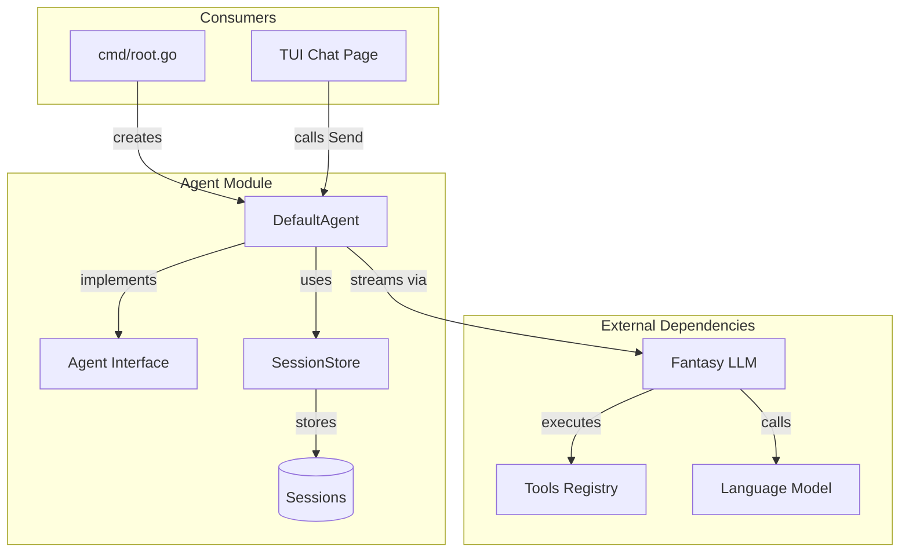

## Data Types

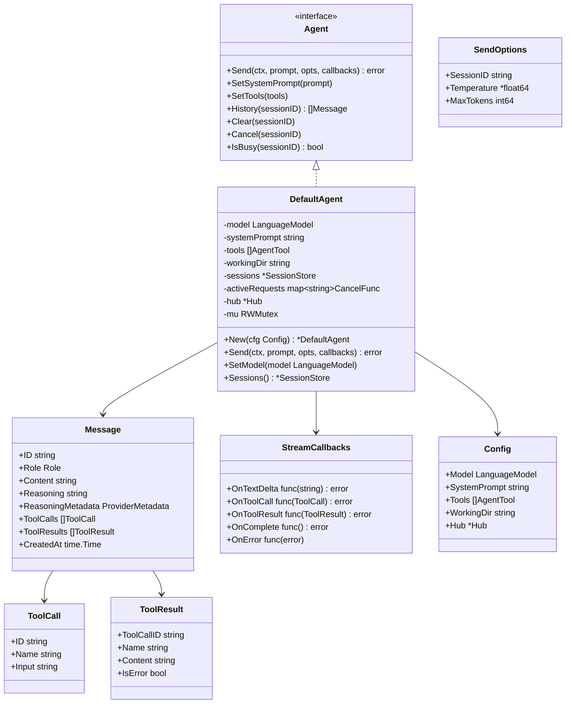

### Message Roles (Role Enum)

Every message in CDD has a role that identifies who sent it. The agent module defines four different message roles using the `Role` type:

| Constant | Value | Description |
|----------|-------|-------------|
| `RoleUser` | `"user"` | User input messages - questions and commands from the human |
| `RoleAssistant` | `"assistant"` | AI responses - text output and tool calls from Claude/GPT |
| `RoleSystem` | `"system"` | System prompt - instructions that guide the AI's behavior |
| `RoleTool` | `"tool"` | Tool execution results - output from tool invocations |

The role determines how the message is processed in the conversation flow. User messages trigger AI responses, assistant messages may contain tool calls, and tool messages provide results back to the AI.

## Agent Execution Flow

The `Send()` method orchestrates the complete request-response cycle:

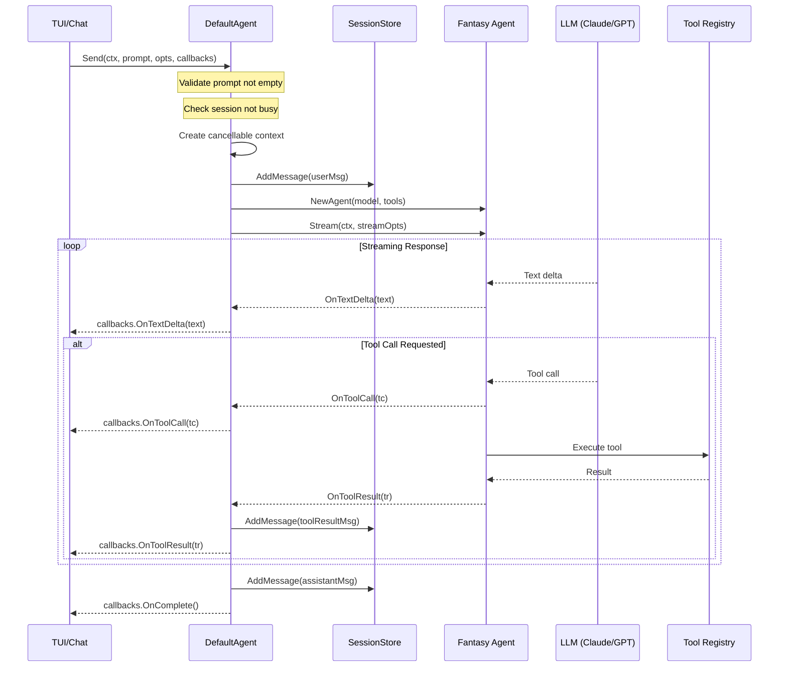

## Session Management

Sessions maintain conversation state across multiple exchanges. To prevent unbounded memory growth, sessions are limited to `MaxSessionMessages = 100` messages. When this limit is exceeded, older messages are automatically trimmed.

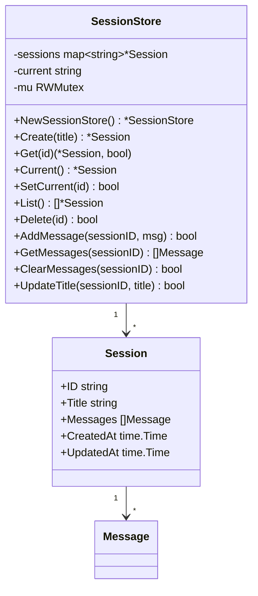

### Session Lifecycle

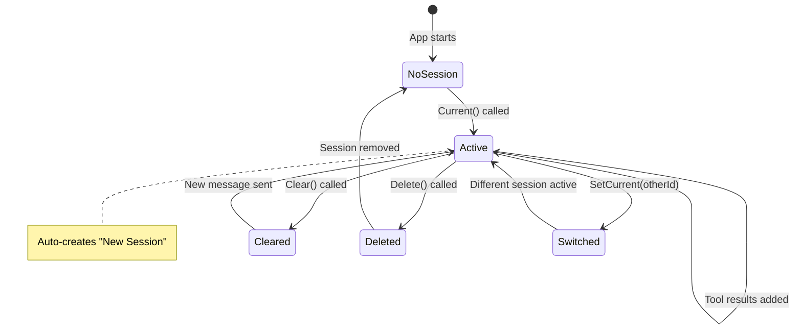

### Thread Safety

All SessionStore operations are protected by `sync.RWMutex`:

| Operation | Lock Type | Notes |
|-----------|-----------|-------|
| `Create()` | Write | Creates session and sets as current |
| `Get()` | Read | Returns session reference |
| `Current()` | Read → Write | Read first, create if needed |
| `AddMessage()` | Write | Appends to session |
| `GetMessages()` | Read | Returns copy of messages |
| `ClearMessages()` | Write | Empties message slice |
| `Delete()` | Write | Removes from map |

## Streaming and Callbacks

The agent uses callbacks for real-time streaming:

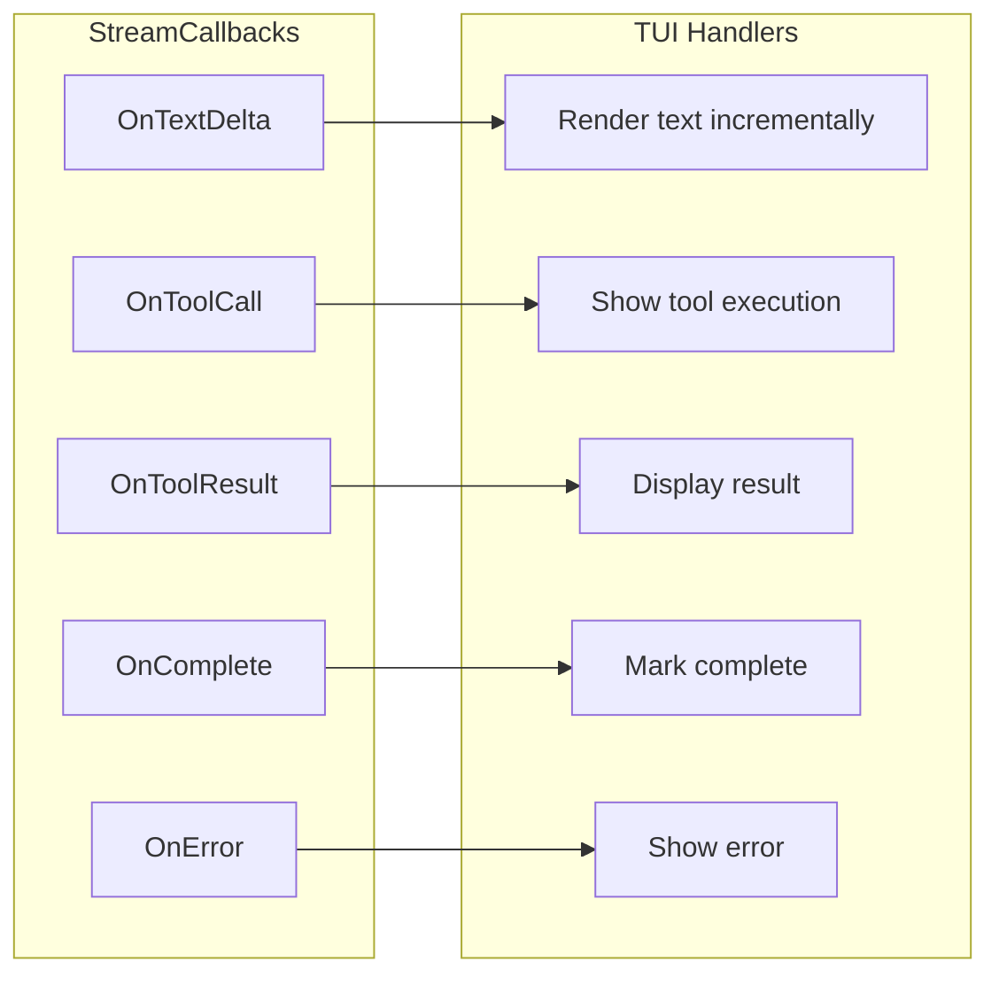

**Callback Flow:**

1. **OnTextDelta**: Called for each text chunk from the model
2. **OnToolCall**: Called when the model requests a tool execution
3. **OnToolResult**: Called after a tool completes (success or error)
4. **OnComplete**: Called when the full response is complete
5. **OnError**: Called if an error occurs during streaming

## System Prompt

The agent uses a two-part system prompt for OAuth compatibility:

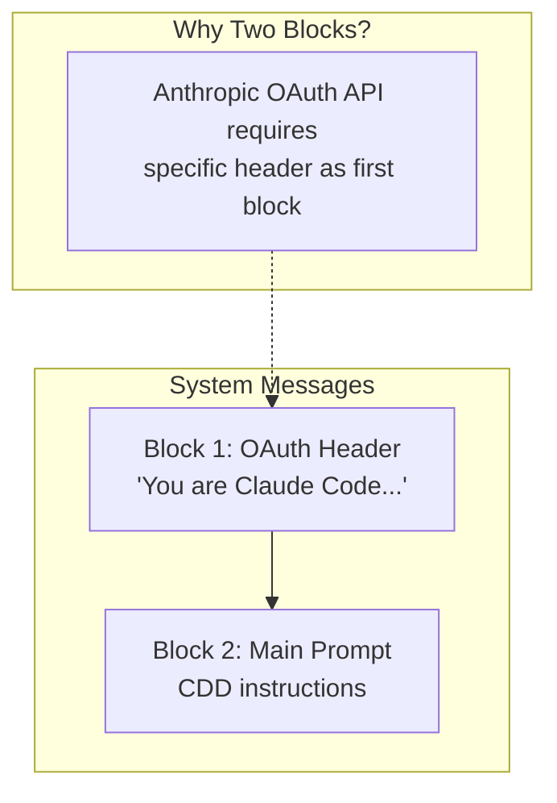

**OAuth Header** (required as first block):
```
You are Claude Code, Anthropic's official CLI for Claude.
```

**Default System Prompt** (`prompt.go`) begins with:
```
You are CDD (Context-Driven Development), an AI coding assistant that lives in your terminal.

You help developers write, understand, and improve code through context-aware workflows.
You understand codebases, execute tasks, and assist with git workflows - all through natural language.
```

The full prompt (~160 lines) covers these key areas:

| Section | Purpose |
|---------|---------|
| Tone and Style | Concise terminal output, markdown formatting, no unnecessary narration |
| Professional Objectivity | Technical accuracy over validation, honest feedback |
| Working With Code | Read before modifying, stay focused, security awareness, clean deletion |
| Tool Usage | Available tools for file operations, search, shell commands, parallel execution |
| Task Management | todo_write usage for complex multi-step tasks |
| Asking Questions | When to clarify vs when to proceed |
| Git Workflows | Safety first, commit guidelines, PR best practices |
| Error Handling | Investigate root cause, try different approaches |

The full prompt is ~160 lines and instructs the agent to:
- Keep responses concise for terminal display
- Never narrate actions (let the todo/activity panels show progress)
- Read files before modifying them
- Stay focused on what was requested (no over-engineering)
- Use todo_write for tracking multi-step tasks
- Follow git safety practices (never force push, skip hooks, etc.)

## Request Cancellation

The agent supports cancelling in-flight requests:

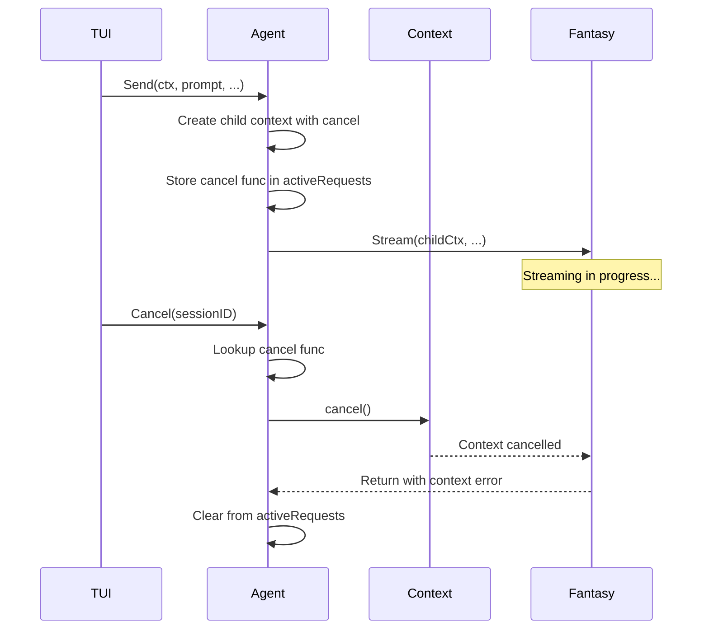

**Key Methods:**

| Method | Purpose |
|--------|---------|
| `Cancel(sessionID)` | Cancels ongoing request for session |
| `IsBusy(sessionID)` | Returns true if request in progress |
| `setActiveRequest()` | Internal: stores cancel func |
| `clearActiveRequest()` | Internal: removes cancel func |

## Tool Execution

Tools are executed by Fantasy during the agent loop. When a tool completes, a `ToolResult` is created with these fields:
- `ToolCallID`: Links result back to the original tool call
- `Content`: The text output from the tool execution
- `IsError`: Boolean flag indicating if the tool failed

The `OnToolResult` callback is invoked to notify the agent of the result.

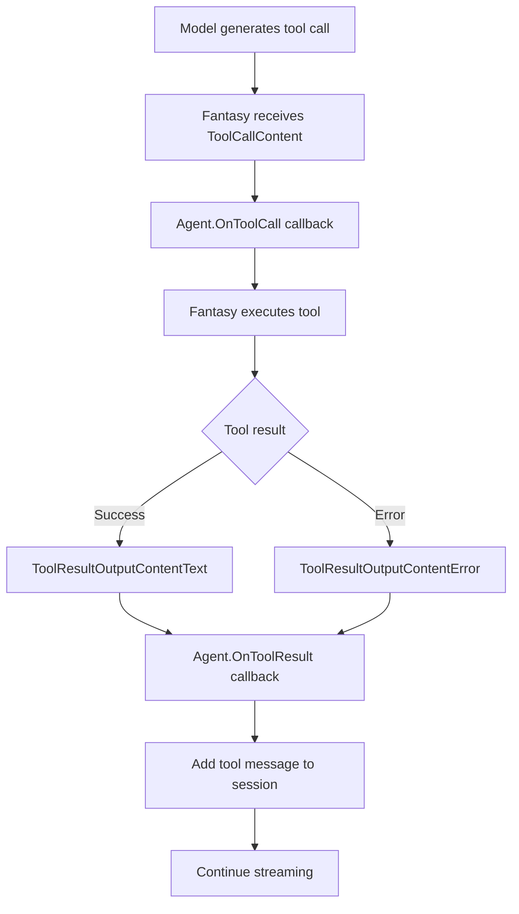

**Tool Result Types:**

| Type | Description |
|------|-------------|
| `Text` | Successful result with text content |
| `Error` | Failed execution with error message |
| `Media` | Binary content (treated as unsupported) |

## PubSub Event Integration

The agent publishes events to a PubSub hub for real-time UI updates and logging. Events are published to two brokers: `Agent` and `Tool`.

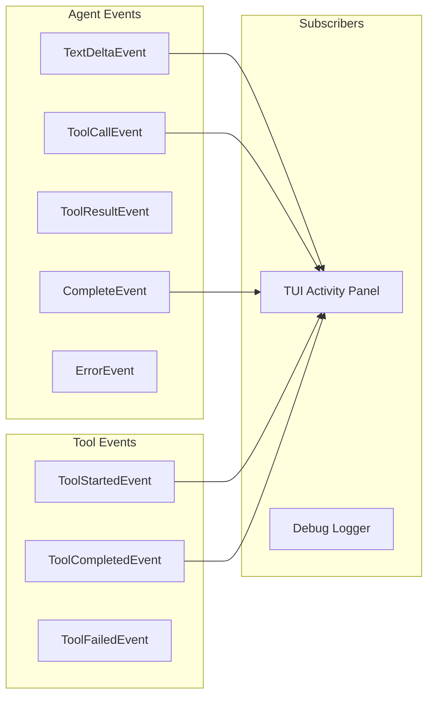

**Event Types:**

| Event | Broker | When Published |
|-------|--------|----------------|
| `TextDeltaEvent` | Agent | Each text chunk from model |
| `ToolCallEvent` | Agent | Model requests tool execution |
| `ToolResultEvent` | Agent | Tool returns result |
| `CompleteEvent` | Agent | Response fully complete |
| `ErrorEvent` | Agent | Error during streaming |
| `ToolStartedEvent` | Tool | Tool execution begins |
| `ToolCompletedEvent` | Tool | Tool succeeds |
| `ToolFailedEvent` | Tool | Tool fails |

Events include `sessionID` and `messageID` for correlation.

## Reasoning/Thinking Support

The agent captures reasoning content from models that support thinking blocks (Claude with extended thinking, MiniMax).

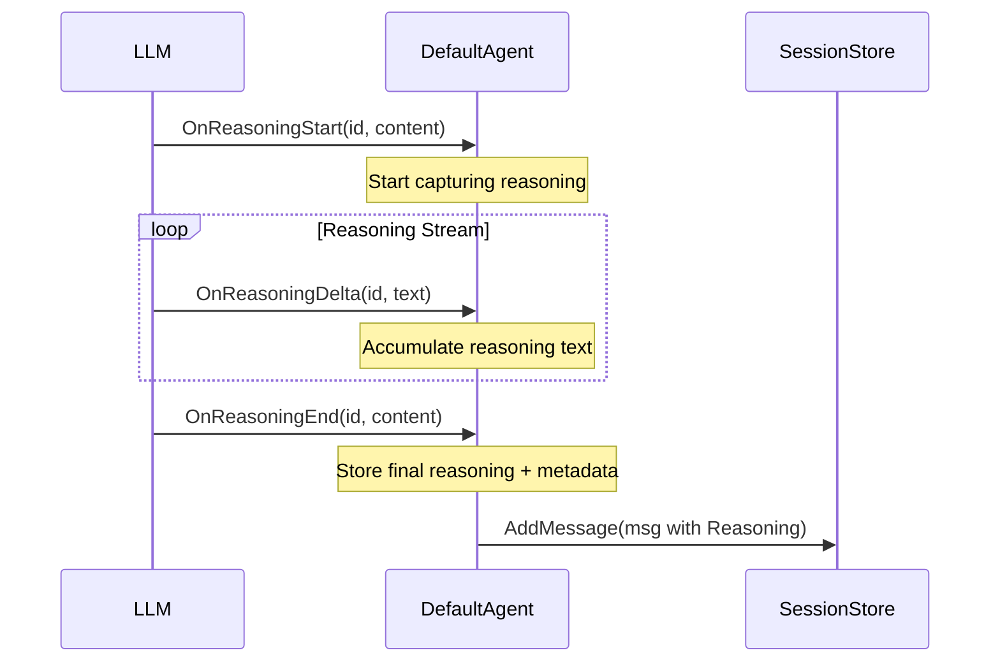

**Key Points:**

- Reasoning is stored in `Message.Reasoning` field
- Provider metadata (e.g., Claude's signature) stored in `Message.ReasoningMetadata`
- Reasoning is **not** sent back to the model in history (signatures become invalid across sessions)
- Only the text content and tool calls are included in conversation history

## History Building

The agent converts session messages to Fantasy format for context:

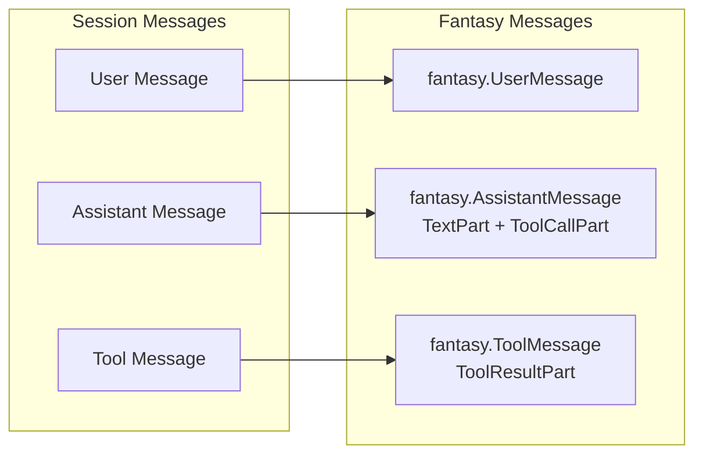

**Important:** The last message (current user input) is excluded from history since it's passed separately as the prompt.

## API Reference

### Agent Interface

The `Agent` interface defines the core contract for AI agent implementations. Its purpose is to provide a consistent API for sending messages, managing conversation history, and controlling execution. The interface enables testing with mock implementations and allows future alternative agent implementations.

**Methods provided by the Agent interface:**

| Method | Signature | Description |
|--------|-----------|-------------|
| `Send` | `(ctx, prompt, opts, callbacks) error` | Send message and stream response |
| `SetSystemPrompt` | `(prompt string)` | Update system prompt |
| `SetTools` | `(tools []AgentTool)` | Update available tools |
| `History` | `(sessionID) []Message` | Get conversation history |
| `Clear` | `(sessionID)` | Clear session history |
| `Cancel` | `(sessionID)` | Cancel ongoing request |
| `IsBusy` | `(sessionID) bool` | Check if request in progress |

### DefaultAgent Additional Methods

| Method | Signature | Description |
|--------|-----------|-------------|
| `New` | `(cfg Config) *DefaultAgent` | Create new agent |
| `SetModel` | `(model LanguageModel)` | Update model (for token refresh) |
| `Sessions` | `() *SessionStore` | Get session store |

### SendOptions

When sending a message to the agent, you can pass options to control the request behavior. The `SendOptions` struct configures how the `Send()` method processes your message.

| Field | Type | Description |
|-------|------|-------------|
| `SessionID` | `string` | Target session (uses current if empty) |
| `Temperature` | `*float64` | Optional sampling temperature for response randomness |
| `MaxTokens` | `int64` | Maximum output tokens (default: 8192) |

**Field Details:**

- **SessionID**: If empty, the agent automatically uses the current active session from the SessionStore. Specify a session ID to target a specific conversation.

- **Temperature**: Controls response randomness. Lower values (e.g., 0.0-0.3) produce more deterministic, focused responses. Higher values (e.g., 0.7-1.0) produce more creative, varied responses. If nil, uses the model's default.

- **MaxTokens**: Limits the maximum number of tokens in the response. The Anthropic API requires this parameter. Default is 8192 if not specified or set to zero.

**Example Usage:**

```go
opts := agent.SendOptions{
    SessionID:   "session-123",
    Temperature: ptr(0.7),
    MaxTokens:   4096,
}
agent.Send(ctx, "Hello", opts, callbacks)
```

### SessionStore Methods

| Method | Signature | Description |
|--------|-----------|-------------|
| `NewSessionStore` | `() *SessionStore` | Create empty store |
| `Create` | `(title) *Session` | Create and set as current |
| `Get` | `(id) (*Session, bool)` | Get session by ID |
| `Current` | `() *Session` | Get or create current session |
| `SetCurrent` | `(id) bool` | Switch current session |
| `List` | `() []*Session` | Get all sessions |
| `Delete` | `(id) bool` | Remove session |
| `AddMessage` | `(sessionID, msg) bool` | Add message to session |
| `GetMessages` | `(sessionID) []Message` | Get session messages (copy) |
| `ClearMessages` | `(sessionID) bool` | Clear session messages |
| `UpdateTitle` | `(sessionID, title) bool` | Update session title |

### Error Types

| Error | Description |
|-------|-------------|
| `ErrSessionBusy` | Session already processing a request |
| `ErrEmptyPrompt` | Empty prompt provided |

## Design Decisions

1. **Interface-based design**: `Agent` interface allows for alternative implementations (testing, mocking)

2. **Session isolation**: Each session maintains its own message history, enabling multiple conversations

3. **In-memory storage**: Sessions are stored in memory for simplicity; persistence can be added later

4. **Callback-based streaming**: Allows TUI to render responses incrementally without buffering

5. **Two-block system prompt**: Required for Anthropic OAuth API compatibility

6. **Copy on read**: `GetMessages()` returns a copy to prevent external mutation

7. **Context cancellation**: Proper cleanup of in-flight requests using context

8. **Tool context injection**: Working directory and session ID passed via context values

9. **PubSub decoupling**: Events published to hub allow loose coupling between agent and UI components

10. **Reasoning exclusion from history**: Thinking blocks contain provider-specific signatures that become invalid across sessions, so only text/tool content is sent back to the model

11. **Message trimming**: Sessions limited to 100 messages to prevent unbounded memory growth in long-running sessions

## Integration Points

### With TUI (Chat Page)

```go
// Create agent in cmd/root.go
agent := agent.New(agent.Config{
    Model:        largeModel,
    Tools:        registry.All(),
    SystemPrompt: agent.DefaultSystemPrompt,
    WorkingDir:   workingDir,
    Hub:          hub, // Optional: for event publishing
})

// Use in chat page
agent.Send(ctx, userInput, agent.SendOptions{}, agent.StreamCallbacks{
    OnTextDelta: func(text string) error {
        // Update UI with streaming text
        return nil
    },
    OnToolCall: func(tc agent.ToolCall) error {
        // Show tool being executed
        return nil
    },
})
```

### With Tools Registry

```go
// Tools are passed at agent creation
registry := tools.DefaultRegistry(workingDir)
agent := agent.New(agent.Config{
    Tools: registry.All(),
})
```

### With Provider/Fantasy

```go
// Model comes from provider builder
builder := provider.NewBuilder(cfg)
largeModel, _, _ := builder.BuildModels(ctx)

agent := agent.New(agent.Config{
    Model: largeModel.Model, // fantasy.LanguageModel
})
```

---

## Related Documentation

- [Provider System](./provider-system.md) - How models are built and configured
- [TUI Wizard](./tui-wizard.md) - Chat page that uses the agent
- [Config Module](./config-module.md) - Configuration that drives agent setup
