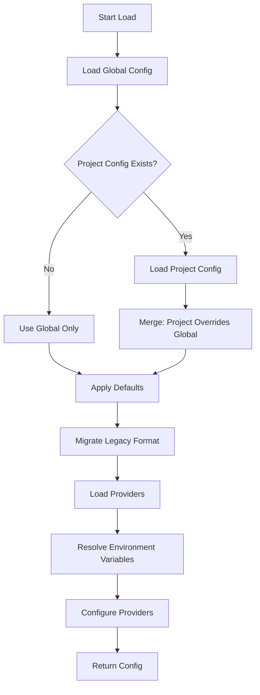
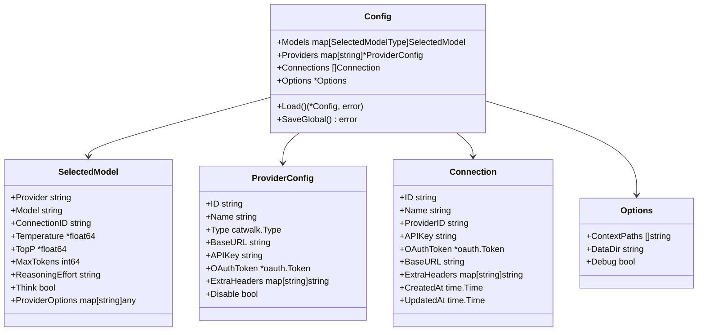
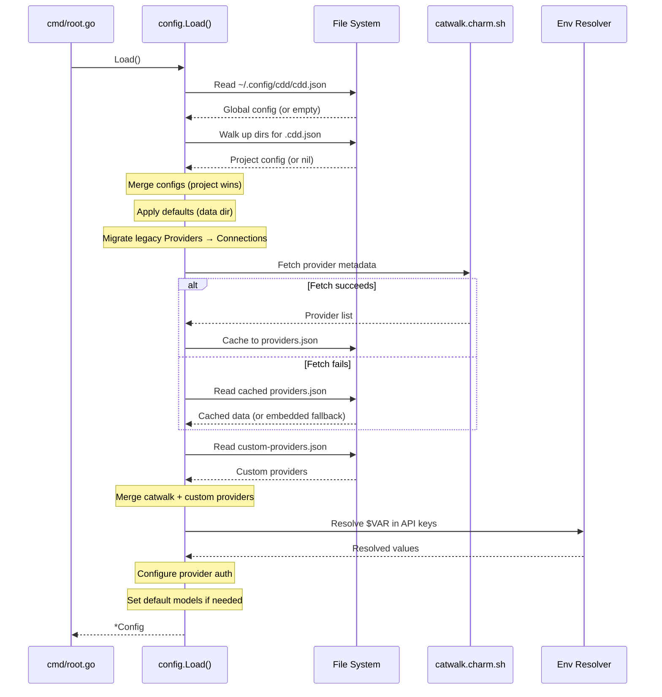
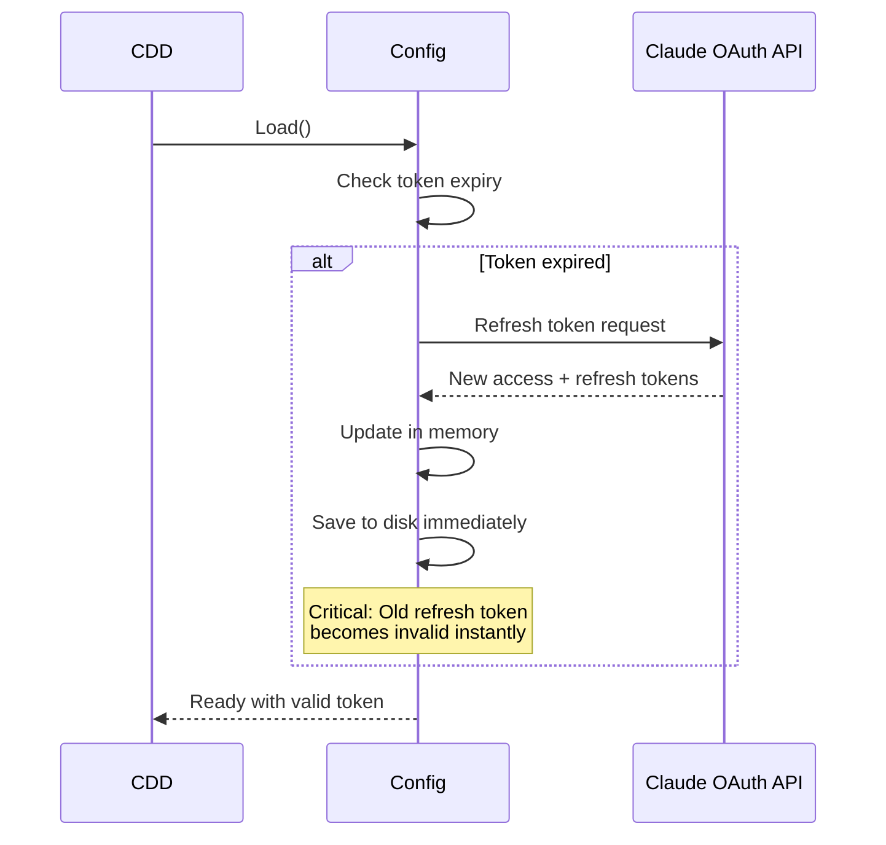

# Config Module

The config module manages all configuration for CDD CLI. It handles loading, merging, validating, and persisting user settings including provider authentication, model selection, and per-project overrides.

## Overview

| Aspect | Details |
|--------|---------|
| Location | `internal/config/` |
| Files | 10 source files |
| Purpose | Configuration management, provider setup, authentication |
| Dependencies | XDG (paths), Catwalk (providers), OAuth (Claude auth) |

The package is organized as follows:

```
internal/config/
├── config.go           - Core types: Config, SelectedModel, ProviderConfig, Options
├── load.go             - Load() function, config merging logic
├── save.go             - SaveGlobal(), SaveWizardResult() persistence
├── connection.go       - Connection type and management
├── providers.go        - LoadProviders(), provider caching from catwalk
├── provider_loader.go  - Custom provider loading from disk
├── custom_provider.go  - CustomProvider type and CustomProviderManager
├── provider_templates.go - Pre-built templates (ollama, lmstudio, etc.)
├── firstrun.go         - IsFirstRun() detection logic
├── resolve.go          - Environment variable resolution ($VAR syntax)
└── migrate.go          - Legacy config migration to connections
```

## Configuration Locations and Precedence

CDD follows the XDG Base Directory Specification for cross-platform compatibility. Configuration is stored in multiple locations with a clear precedence order:

| Type | Path | Purpose |
|------|------|---------|
| Global Config | `~/.config/cdd/cdd.json` | User's primary settings |
| Project Config | `.cdd.json` or `cdd.json` | Per-project overrides (walks up directory tree) |
| Custom Providers | `~/.local/share/cdd/custom-providers.json` | User-defined providers |
| Provider Cache | `~/.local/share/cdd/providers.json` | Cached catwalk metadata (24h TTL) |
| Debug Log | `~/.local/share/cdd/debug.log` | Debug output (when --debug flag used) |

Project configuration takes precedence over global configuration. When CDD loads, it first reads the global config, then looks for a project config by walking up the directory tree from the current working directory. If found, project settings override global settings. This allows teams to share provider settings or model preferences per repository via version control.



## Data Types

The config module defines several key data structures for managing configuration state. The main `Config` struct holds model selections, provider configurations, connections, and options. CDD uses a two-tier model system to optimize for different task types: **Large** models for complex reasoning and code generation, and **Small** models for quick tasks (falls back to large if not configured).



## Configuration Loading and First-Run Detection

The `Load()` function orchestrates the complete configuration pipeline: loading files, merging configs, migrating legacy formats, resolving environment variables, and configuring providers.



**First-Run Detection:** CDD detects first-run to trigger the setup wizard using the `IsFirstRun()` function. It returns true when: (1) no configuration file exists at `~/.config/cdd/cdd.json`, OR (2) configuration exists but has no authenticated connections or providers. This ensures users are guided through setup even if they have a partial or empty config file. When first-run is detected, CDD launches an interactive wizard that guides users through provider selection, authentication method choice (OAuth or API key), and model selection for both large and small tiers.

## Environment Variables

CDD supports environment variable substitution in configuration values using `$VAR` or `${VAR}` syntax. This keeps secrets out of config files for security, allowing you to store API keys in your shell environment rather than in plain text configuration files. Variables are resolved at load time using the `Resolver` component in `resolve.go`, so environment variables must be set before running CDD.

Supported patterns include: simple references like `$ANTHROPIC_API_KEY` which get replaced with the variable's value, bracketed references like `${OPENAI_KEY}` which work the same way but allow the variable name to be clearly delimited, and mixed strings like `"Bearer $API_KEY"` where the variable is embedded within other text. The resolver handles all these patterns uniformly.

If a referenced environment variable is undefined, the `Load()` function returns an error that identifies the missing variable name, helping you quickly diagnose configuration issues. This fail-fast behavior prevents CDD from running with incomplete authentication.

Example configuration using environment variables shows how to reference your API keys without exposing them in the config file: set `"api_key": "$ANTHROPIC_API_KEY"` in your config, then export the actual key in your shell with `export ANTHROPIC_API_KEY=sk-ant-...` before running CDD.

## Authentication Methods

CDD supports two authentication methods for providers: API keys and OAuth tokens.

**API Key Authentication:** The simplest method - provide your API key directly or reference an environment variable. The key is sent with each request to the provider. Example: `"api_key": "$ANTHROPIC_API_KEY"` in your config file. This works with all providers that support API key authentication.

**OAuth Authentication (Claude):** For Anthropic's Claude, CDD supports OAuth with automatic token refresh. OAuth tokens include an access token, refresh token, and expiration timestamp. When the access token expires, CDD automatically refreshes it using the refresh token and persists the new tokens immediately to disk. This immediate persistence is critical because Anthropic uses token rotation - the old refresh token becomes invalid as soon as a new one is issued. If tokens aren't saved immediately after refresh, authentication could be lost.



## Provider System

CDD's provider system combines built-in providers from Catwalk with user-defined custom providers. Built-in providers are fetched from `catwalk.charm.sh` and cached locally for 24 hours, enabling offline usage. Custom providers allow users to connect to local models (Ollama, LM Studio) or alternative API endpoints.

**Built-in Providers (Catwalk):** These include Anthropic (Claude models), OpenAI (GPT-4o, o1, o3), and Google (Gemini). Provider metadata is fetched automatically and cached.

**Custom Providers:** Users can define custom providers for local or alternative API endpoints. Custom providers are stored in `~/.local/share/cdd/custom-providers.json` and include fields like name, ID, type (OpenAI or Anthropic compatible), API endpoint, default headers, and model definitions.

**Available Templates:** CDD provides pre-built templates for common providers to reduce setup friction:

| Template | Description | Default Base URL |
|----------|-------------|------------------|
| `ollama` | Local Ollama server | `http://localhost:11434/v1` |
| `lmstudio` | LM Studio UI | `http://localhost:1234/v1` |
| `openrouter` | OpenRouter API | `https://openrouter.ai/api/v1` |
| `together` | Together AI | `https://api.together.xyz/v1` |
| `deepseek` | Deepseek API | `https://api.deepseek.com/v1` |
| `groq` | Groq API | `https://api.groq.com/openai/v1` |
| `anthropic-compatible` | Generic Anthropic-compatible | (user specified) |
| `azure-openai` | Azure OpenAI | (user specified) |
| `vertexai` | Google Vertex AI | (user specified) |

## CLI Reference

CDD provides CLI commands for managing providers and checking configuration status. All provider management is done through the `cdd providers` subcommand. Use `cdd providers list` to see all available providers, with optional flags `--catwalk-only` for built-in providers or `--custom-only` for user-defined ones. To inspect a specific provider's details, use `cdd providers show <provider-id>` (e.g., `cdd providers show anthropic`).

To add custom providers, use templates with `cdd providers add-template <name>`. For example, `cdd providers add-template ollama` sets up a local Ollama server, and you can customize it with `--id`, `--name`, or `--var` flags. You can also import provider definitions from files with `cdd providers add-file <path>` or from URLs with `cdd providers add-url <url>`.

To manage existing custom providers, use `cdd providers remove <id>` to delete one, `cdd providers export <file>` to back up your configurations, and `cdd providers validate` to check for configuration errors (add `--verbose` for detailed output).

Additional commands include `cdd status` to check your current configuration and model selection, and `cdd --debug` to enable debug logging which outputs to `~/.local/share/cdd/debug.log`.

**Command Summary:**

| Command | Description |
|---------|-------------|
| `cdd providers list` | List all providers |
| `cdd providers show <id>` | Show provider details |
| `cdd providers add-template <name>` | Add from template (ollama, lmstudio, etc.) |
| `cdd providers add-file <path>` | Import from JSON file |
| `cdd providers remove <id>` | Remove a custom provider |
| `cdd providers validate` | Validate configurations |
| `cdd status` | Show current config status |
| `cdd --debug` | Enable debug logging |

## Configuration File Format and Examples

This section shows what the CDD configuration JSON file looks like in practice. The `cdd.json` file structure contains models, providers, connections, and options. Here are complete examples showing the JSON format for common scenarios.

**Minimal Configuration (API Key):** The simplest setup using an API key for Anthropic:

```json
{
  "models": {
    "large": { "provider": "anthropic", "model": "claude-sonnet-4-20250514" },
    "small": { "provider": "anthropic", "model": "claude-3-5-haiku-20241022" }
  },
  "providers": {
    "anthropic": { "api_key": "$ANTHROPIC_API_KEY" }
  }
}
```

**OAuth Configuration:** Using OAuth authentication with automatic token refresh:

```json
{
  "models": {
    "large": { "provider": "anthropic", "model": "claude-sonnet-4-20250514" }
  },
  "providers": {
    "anthropic": {
      "oauth": {
        "access_token": "token_abc123...",
        "refresh_token": "refresh_xyz789...",
        "expires_at": 1704067200
      }
    }
  }
}
```

**Multiple Connections:** Using the connections system for multiple accounts:

```json
{
  "models": {
    "large": { "connection_id": "work-claude", "model": "claude-sonnet-4-20250514" },
    "small": { "connection_id": "personal-claude", "model": "claude-3-5-haiku-20241022" }
  },
  "connections": [
    { "id": "work-claude", "name": "Work Account", "provider_id": "anthropic", "api_key": "$WORK_ANTHROPIC_KEY" },
    { "id": "personal-claude", "name": "Personal", "provider_id": "anthropic", "api_key": "$PERSONAL_KEY" }
  ]
}
```

**Local Model with Ollama:** Running models locally:

```json
{
  "models": {
    "large": { "provider": "my-ollama", "model": "llama3.1:70b" },
    "small": { "provider": "my-ollama", "model": "llama3.1:8b" }
  },
  "providers": {
    "my-ollama": { "base_url": "http://localhost:11434/v1" }
  }
}
```

**Project-Level Override:** Place in `.cdd.json` at project root to override global settings:

```json
{
  "models": { "large": { "provider": "openai", "model": "gpt-4o" } },
  "options": { "context_paths": ["src/", "docs/"] }
}
```

## Validation and Migration

The config module includes validation for custom providers and automatic migration for backward compatibility.

**Provider Validation:** Before saving, custom providers are validated for: ID uniqueness across all providers, required fields (name, type), valid model definitions (each model needs ID, name, context window), default model references pointing to existing models, and proper API endpoint format. Validation returns errors for critical issues and warnings for potential problems.

**Backward Compatibility Migration:** CDD automatically migrates legacy configuration formats to the new connections system. The old format used a `Providers` map with inline authentication; the new format separates provider metadata from authentication using a `Connections` array. Migration runs automatically during `Load()`: it converts each `ProviderConfig` with authentication to a `Connection`, updates model selections to reference connections via `connection_id`, and preserves original provider entries for compatibility with older CDD versions.

## Design Decisions

1. **XDG Compliance**: Uses standard paths (`~/.config`, `~/.local/share`) for cross-platform compatibility and clean home directories

2. **Project Config Precedence**: Allows teams to share settings via version control while users maintain personal global defaults

3. **Environment Variable Resolution**: Keeps secrets out of config files; resolved at load time for security

4. **Two-Tier Model System**: Optimizes cost/speed by using appropriate model sizes for different task complexities

5. **Connections vs Providers**: Separates provider metadata (static) from authentication (user-specific), enabling multiple accounts per provider

6. **Immediate Token Persistence**: OAuth tokens saved immediately after refresh to handle Anthropic's token rotation safely

7. **Provider Caching**: 24-hour cache of catwalk metadata enables offline usage and reduces API calls

8. **Template System**: Common provider configurations as templates reduce setup friction for popular services

9. **Graceful Degradation**: Falls back to cached → embedded providers if catwalk is unreachable

10. **Validation Before Save**: Prevents invalid configurations from being persisted

## Integration Points

The config module integrates with several other CDD components. In `cmd/root.go`, configuration is loaded at startup using `config.Load()`, and `config.IsFirstRun()` determines whether to show the setup wizard. The provider builder (`provider.NewBuilder(cfg)`) uses the loaded configuration to instantiate language models via `builder.BuildModels(ctx)`. The TUI wizard saves results using `config.SaveWizardResult()` with provider ID, API key or OAuth token, and selected models. Provider CLI commands use `config.NewCustomProviderManager()` to load, add, and remove custom providers.

```go
// Load configuration at startup
cfg, err := config.Load()
if err != nil {
    return fmt.Errorf("failed to load config: %w", err)
}

// Check if first run - triggers setup wizard
if config.IsFirstRun() {
    // Show setup wizard
}

// Build models from configuration
builder := provider.NewBuilder(cfg)
largeModel, smallModel, err := builder.BuildModels(ctx)
```

---

## Related Documentation

- [Agent Module](./agent-module.md) - Uses configured models for AI interactions
