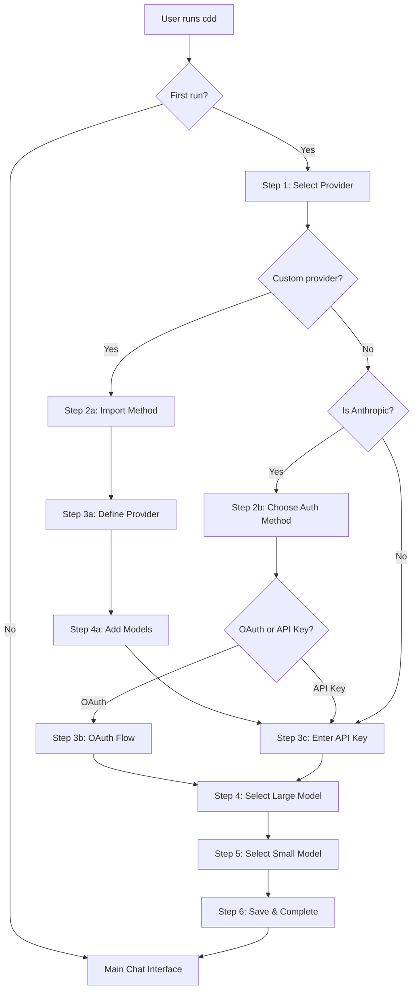

# TUI Wizard

The TUI Wizard is the first-run setup experience that guides new users through configuring CDD. When users run `cdd` for the first time without any configuration, the wizard walks them through provider selection, authentication, and model selection to create a working configuration file.

## Overview

| Aspect | Details |
|--------|---------|
| Location | `internal/tui/components/wizard/` |
| Files | 8 source files |
| Purpose | Interactive first-run setup and configuration |
| Dependencies | Bubble Tea (TUI), Catwalk (providers), OAuth (Claude auth), Config |

The wizard package is organized as follows:

```
internal/tui/components/wizard/
├── wizard.go                 - Main orchestrator, step flow logic
├── provider.go               - Provider selection list
├── method.go                 - Auth method chooser (OAuth vs API Key)
├── oauth.go                  - OAuth flow with PKCE
├── apikey.go                 - API key input field
├── model.go                  - Model selection list (large/small)
├── custom_provider_method.go - Custom provider import method
├── custom_provider_define.go - Custom provider definition form
└── custom_provider_models.go - Custom provider model configuration
```

## What Happens When You First Run CDD

When you run `cdd` for the first time, the application detects that no configuration exists using `config.IsFirstRun()`. This triggers the setup wizard instead of the normal chat interface. The wizard guides you through a series of steps to configure your AI provider, authenticate, and select which models to use. Once complete, the wizard saves your configuration to `~/.config/cdd/cdd.json` and transitions you to the main chat interface where you can start using CDD.

The wizard provides a friendly, interactive experience with keyboard navigation, visual progress indicators, and the ability to go back to previous steps if you make a mistake. It handles both simple setups (just an API key) and complex ones (OAuth authentication or custom local providers like Ollama).

## Wizard Flow and Steps

The wizard consists of 10 possible steps, though not all steps are shown to every user. The flow branches based on whether you choose a built-in provider or custom provider, and whether you authenticate with OAuth or an API key.



**Standard flow for Anthropic with API key:** Provider → API Key → Large Model → Small Model → Complete (4 steps)

**Standard flow for Anthropic with OAuth:** Provider → Auth Method → OAuth → Large Model → Small Model → Complete (5 steps)

**Standard flow for other providers:** Provider → API Key → Large Model → Small Model → Complete (4 steps)

**Custom provider flow:** Provider → Import Method → Define Provider → Add Models → API Key → Large Model → Small Model → Complete (7 steps)

## Provider Selection Step

The first step lets you choose which LLM provider to use. The wizard displays a list of all available providers from Catwalk (Anthropic, OpenAI, Google, etc.) plus an option to add a custom provider for local models or alternative endpoints.

Use the arrow keys (↑/↓) or vim-style keys (j/k) to navigate the list, and press Enter to select. The list shows the provider name, and each provider comes with pre-configured models and default settings. If you select "Add Custom Provider", you'll enter the custom provider flow to define your own provider configuration.

**Built-in providers include:** Anthropic (Claude models), OpenAI (GPT-4o, o1, o3), Google (Gemini), and others that are fetched from the Catwalk service and cached locally.

## Authentication Methods for Anthropic

When you select Anthropic as your provider, the wizard presents a choice between two authentication methods: OAuth (labeled "Claude Account") or API Key. This step only appears for Anthropic - other providers skip directly to the API key input.

**OAuth authentication** lets you sign in with your Anthropic account through a browser-based flow. This is convenient if you don't have an API key handy or prefer not to manage keys manually. The OAuth flow uses PKCE (Proof Key for Code Exchange) for security.

**API Key authentication** is the traditional method where you enter your Anthropic API key directly. You can enter the key as plain text or reference an environment variable using the `$` prefix (e.g., `$ANTHROPIC_API_KEY`).

Navigate between options using arrow keys (←/→) or Tab, and press Enter to confirm your choice.

## How the OAuth Flow Works

The OAuth flow provides secure authentication through your browser. When you select OAuth, the wizard generates a PKCE challenge for security and displays an authorization URL. Press Enter to open this URL in your default browser, where you'll sign in to your Anthropic account and authorize CDD to access the API.

After authorizing in the browser, Anthropic displays a code that you copy and paste back into the terminal. The wizard validates this code by exchanging it for access and refresh tokens. A spinner shows while validation is in progress. If the code is valid, a checkmark appears and you can continue. If invalid, you can try entering the code again.

The OAuth tokens include an access token (used for API calls), a refresh token (used to get new access tokens when they expire), and an expiration timestamp. CDD automatically refreshes tokens when needed, so you don't have to re-authenticate manually.

**PKCE security:** The wizard generates a random verifier and derives a challenge from it. The challenge is sent to Anthropic during authorization, and the verifier is sent when exchanging the code for tokens. This prevents authorization code interception attacks.

## API Key Input and Environment Variables

The API key input step lets you enter your provider's API key. By default, the input shows asterisks for security (password mode). Press Tab to toggle between hidden and visible modes if you need to verify what you typed.

You can enter the API key directly, or reference an environment variable by prefixing with `$`. For example, entering `$ANTHROPIC_API_KEY` tells CDD to read the actual key from that environment variable at runtime. This keeps secrets out of the config file and makes it easy to rotate keys without editing configuration.

When you use environment variable syntax, the input automatically switches to visible mode since there's no secret to hide. The wizard shows the path where your configuration will be saved, so you know where to find it later. Press Enter to continue once you've entered your key.

## Model Selection for Large and Small Tiers

After authentication, you select which models to use for CDD's two-tier system. The large model handles complex reasoning tasks like code generation, analysis, and multi-step problems. The small model handles simpler, faster tasks where speed matters more than capability.

**Large model selection:** The wizard displays all available models for your chosen provider. Use arrow keys to navigate and Enter to select. If the provider has a default large model configured, it will be pre-selected. For Anthropic, this is typically Claude Sonnet.

**Small model selection:** Same interface as large model selection, but for the small tier. For Anthropic, this is typically Claude Haiku. If you don't need a separate small model, you can select the same model for both tiers.

Each model in the list shows its name and ID in parentheses (e.g., "Claude 3.5 Sonnet (claude-3-5-sonnet-20241022)"). The models come from the provider's configuration in Catwalk, which includes context window size, pricing, and other metadata.

## Custom Provider Setup Flow

If you select "Add Custom Provider", the wizard guides you through defining a custom provider for local models (like Ollama or LM Studio) or alternative API endpoints. This flow has three main parts: choosing an import method, defining the provider, and adding models.

**Import method:** Currently supports manual definition. Future versions will support importing from URL or file.

**Provider definition:** A multi-step form collects the provider name (friendly display name), provider ID (unique identifier, auto-generated from name if left blank), provider type (openai-compat, anthropic, google, etc.), API endpoint (base URL like `http://localhost:11434/v1` for Ollama), and optional default headers.

**Model configuration:** Add one or more models with name, ID, context window size (default 128,000 tokens), cost per million input/output tokens (for tracking), and default max tokens (default 4,096). You can add multiple models and press Tab to finish when done.

The custom provider is saved to `~/.local/share/cdd/custom-providers.json` and then appears in the provider list for future use. After defining the provider, you continue with API key input (if required) and model selection.

## Keyboard Navigation and Shortcuts

The wizard supports consistent keyboard navigation across all steps. You can always go back to the previous step by pressing Escape (except on the first step). Each step type has appropriate navigation controls.

**List navigation (providers, models):** Use ↑/↓ or j/k to move up and down, Enter to select the highlighted item.

**Choice selection (auth method):** Use ←/→ or h/l to switch between options, Tab to toggle, Enter to confirm.

**Text input (API key, provider fields):** Type normally, Enter to submit, Tab for special actions (toggle visibility for API key, skip optional fields for provider definition).

**OAuth flow:** Enter to open browser (URL state), Enter to validate code (code state), Enter to continue (after validation).

**Progress indicator:** The wizard shows a visual progress bar indicating completed steps, current step, and remaining steps. The indicator adapts based on your authentication path (OAuth vs API key).

## Configuration Save and Completion

When you complete all steps, the wizard saves your configuration and displays a summary. The summary shows your selected provider, authentication type, and both model selections. It also displays the path where the configuration was saved.

**For API key authentication:** The wizard calls `config.SaveWizardResult()` which creates a connection with your API key, sets your model selections, and writes the config to disk.

**For OAuth authentication:** The wizard calls `config.SaveWizardResultWithOAuth()` which stores the OAuth tokens in the connection, sets your model selections, and writes the config to disk. The tokens will be automatically refreshed when they expire.

After saving, the wizard transitions you to the main chat interface where you can immediately start using CDD. Your configuration persists across sessions, so you won't see the wizard again unless you delete your config file or it becomes invalid.

## State Management and Data Flow

The wizard maintains state for each step and the overall flow using Bubble Tea's message-passing architecture. When you make a selection, the component sends a message that the main wizard receives and uses to update state and transition to the next step.

**Key state tracked by the wizard:**
- `selectedProvider` - The chosen catwalk.Provider (built-in or custom)
- `selectedCustomProvider` - Custom provider definition if applicable
- `authMethod` - OAuth or API Key choice
- `oauthToken` - OAuth tokens if using OAuth authentication
- `apiKey` - API key string if using API key authentication
- `selectedLarge` - The chosen large model
- `selectedSmall` - The chosen small model
- `step` - Current wizard step for navigation

**Message types for transitions:** `ProviderSelectedMsg`, `AuthMethodSelectedMsg`, `OAuthCompleteMsg`, `APIKeyEnteredMsg`, `ModelSelectedMsg`, and `CompleteMsg`. Each message carries the data collected from that step, allowing the wizard to maintain a complete picture of the user's choices.

## Integration with Config and Catwalk

The wizard integrates with two key systems: the config module for persistence and Catwalk for provider metadata.

**Catwalk integration:** The wizard receives a list of `catwalk.Provider` objects containing provider metadata, available models, default model selections, and API endpoint information. Custom providers are converted to `catwalk.Provider` format using `ToCatwalkProvider()` for consistent handling.

**Config integration:** When the wizard completes, it calls the appropriate save function based on authentication type. The config module creates a Connection (containing auth credentials), sets model selections (mapping "large" and "small" to specific models and connections), and writes everything to the config file using XDG-compliant paths.

```go
// API Key save
config.SaveWizardResult(providerID, apiKey, largeModelID, smallModelID)

// OAuth save
config.SaveWizardResultWithOAuth(providerID, oauthToken, largeModelID, smallModelID)
```

The wizard also uses `config.CustomProviderManager` to save custom provider definitions separately from the main config, allowing them to be shared and reused.

---

## Related Documentation

- [Config Module](./config-module.md) - How configuration is stored and loaded
- [Agent Module](./agent-module.md) - The AI agent that uses the configured models
